##############
Liquid Account
##############

************
Introduction
************

How to use application
======================

Main interface
--------------
The main menu brings you to the different applications in the IQNOMY platform.

.. image::

.. glossary::
   Campus
      The application to provide you with support for the IQNOMY platform.
   Your Liquid Account name
      Every liquid account has a unique number. Next to the number you can give your Liquid Account any name you want.
   Liquid Accounts
      One user can have access to multiple Liquid Accounts. For every liquid account different roles (owner, administrator or reporter) can be set.
   User account
      'My account' You can change your user settings.
   Liquid account
      You can change the main settings of the Liquid Account you are managing at the moment.
   Logout
      Logout can be done by clicking this button or deleting all you cookies. After 8 hours after login you will automaticly logged out.

The liquid account submenu has the following functionalities

.. glossary::
   Step by step
      This will link to the step by step pages. These pages will help you configuring your Liquid Account
   Discovery
      Links to the Discovery page
   Live stream
      Links to the Live stream page
   Engagescore
      Links to the Engagescore main screen
   Dimensions
      Links to the Dimensions main screen
   Containers
      Links to the Containers main screen
   Support
      The 'i' represents information. Searching with a keyword will bring you to the support page.

The content screen
   Every content screen will show a title of the screen. Underneath this title the content of the screen will show.

Liquid Accounts
---------------
.. glossary::
   Liquid Account
      The account that provides access to the services for bundling channels, collect and enrich profiles and personalize content.

The Liquid Account overview page shows a list of Liquid Account where this user has access to. Every user has a different list on this page. If you want access to an existing Liquid Account you will have to ask for access to the owner.

By using 'Add Liquid Account' you can create a new liquid account.

Explaining the information in the table

My liquid account
   This shows the list of liquid accounts you have access to
Industry
   The industry where this liquid account is added to.
Account type
   EngageScore Basis, EngageScore plus or Liquid internet
Connected
   A 'V' shows if the liquid account is active. A 'X' represents not active. The date in this column represents the day the first profile was created.
Last login
   the last time this account was accessed by an IQNOMY user
Owner
   shows the emailadress of the owner of the account
Role
   Your role for this liquid account. This can be Owner, Administrator or Reporter
Profiles active
   This shows the number of profiles that are active at the moment of opening this overview
Containers
   Shows the amount of containers available within this account

Add Liquid Account
------------------

Realtime
--------

Discovery
---------

Use integration
===============

***********
EngageScore
***********
EngageScore is the part of the platform where you can benchmark your performance with others in your industry. The EngageScore functionality will provide you with performance indicators that you can improve.

EngageScore dashboard
=====================

.. image:: _static/images/EngageScore.png

.. glossary::
   EngageScore
      EngageScore is an unique realtime scoring method based on consumption, interaction and participation.
      In realtime the average engagement of your website visitors will be calculated and compared to the previous week.
      An algorithmic approach is used with maximum score 5.00.
   Your ranking
      Your ranking number shows your position against the total number of IQNOMY members. The ranking is calculated every day at the end of the day.
      You have your overall ranking and the ranking in the industry.
      The ranking shown on the engagescore dashboard is the overall ranking.
      If you want to see your ranking in your Industry.
      Go to the ranking list page.
   Engage Value
      EngageValue indicates the potential value of your website visitors. To each EngagePoint a value of € 0.47 is assigned.
      This value is a variable, it can be adjusted by IQNOMY.
      In future releases it is possible to adjust your own value.
   Visitor ticker
      The visitor ticker shows realtime profiles with there EngageScore. You can click to go to the Live Stream
   Overall EngageScore
      This graph shows your EngageScore in time
   EngagePoints
      The amount of EngagePoints are based on the assists a website visitor is making. Weights are created based on assists on the website.
      For example, page visits will receive a lower rank than someone who is writing a productreview.
      The EngagePoints are compared to the previous week. All the possible assists on your website are taken into account.
      If you are doubting click here to review the assists and adjust them if necessary.
   Average EngageValue
      The amount of EngagePoints are based on the assists a website visitor is making.
      Weights are created based on assists on the website. For example, page visits will receive a lower rank than someone who is writing a productreview.
      The EngagePoints are compared to the previous week. All the possible assists on your website are taken into account.
      If you are doubting click here to review the assists and adjust them if necessary.
   Expected EngageValue
      The expected EngageValue indicates your monetary value compared to the same day in the previous week.
   Industry average EngageScore
      You EngageScore in time benchmarked against you industries average.                   |
   Industry EngageValue
      For explanation EngageValue click the 'i' at EngageValue at the EngageValue box.      |

EngageScore Insight
===================

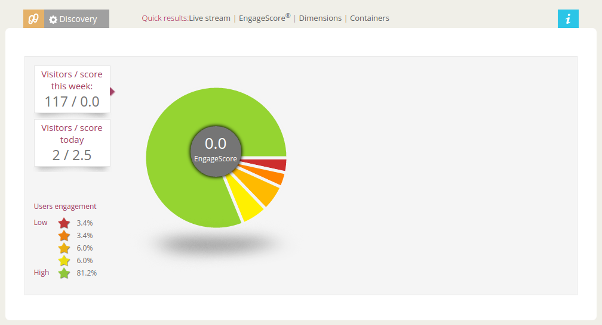

.. glossary::

   Your ranking
      Every night your EngageScore is compare with all the companies in your industry and globally with all other
      IQNOMY users. Based on this you get a ranking.
   Ranking competitors
      Shows the amount of participants in the Ranking list
   Improvements for higher ranking
      Based on your EngageScore calculation IQNOMY provides suggestions to improve your ranking by getting a higher EngageScore.
   Newest members
      The last non-anonymous companies that are using the IQNOMY platform.

Ranking list
============

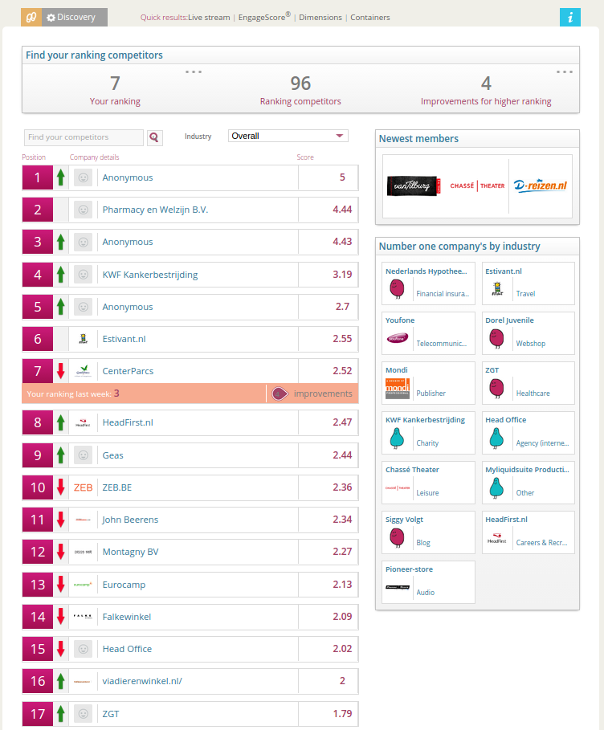

.. glossary::
   Users engagement
      User engagement is defined in a score from 0 to 5, where 5 is high. This score is based on the RFD model.

********
Profiles
********

Website Visitors
================

Follow yourself on your website
IQNOMY will compose visitors profile for every website visitor. How can I look up my own profile? First you need to find your Visitor ID (visitor ID).
Chrome:

#. Go to your website (IQNOMY script has to be implemented)
#. Click right mouse button ‘Inspect element’
#. Select tab ‘Network’
#. Click F5
#. Search URL starting with http://liquifier.iqnomy.com/myliquidsuite-ws/
#. Click on the URL – it will appear on the right side. In the URL you can find a VID = 10 numbers
#. Copy the VID

Rule engine
===========

Dimensions
==========

Dimensions overview
~~~~~~~~~~~~~~~~~~~

Dimensions list
~~~~~~~~~~~~~~~

Edit dimension
~~~~~~~~~~~~~~

Configuration
+++++++++++++

Properties
++++++++++

Rules
+++++

Add dimension
~~~~~~~~~~~~~

Choose type
+++++++++++

Add properties
++++++++++++++

Add rule
++++++++

***************
Liquid internet
***************

Containers
==========

Container conversion
~~~~~~~~~~~~~~~~~~~~

Container list
~~~~~~~~~~~~~~

Container who
~~~~~~~~~~~~~

Container where
~~~~~~~~~~~~~~~

Container how
~~~~~~~~~~~~~

Container what
~~~~~~~~~~~~~~

Container summary
~~~~~~~~~~~~~~~~~

Container report general
~~~~~~~~~~~~~~~~~~~~~~~~

Container report content
~~~~~~~~~~~~~~~~~~~~~~~~

Liquid content
==============

Liquid content overview
~~~~~~~~~~~~~~~~~~~~~~~

Liquid content detail
~~~~~~~~~~~~~~~~~~~~~
This is the edit/add and view screen of one liquid content

Resource collection
===================

Resource collections overview
~~~~~~~~~~~~~~~~~~~~~~~~~~~~~

Resource collection content overview
~~~~~~~~~~~~~~~~~~~~~~~~~~~~~~~~~~~~

Resource collection content detail
~~~~~~~~~~~~~~~~~~~~~~~~~~~~~~~~~~

Attributes overview
~~~~~~~~~~~~~~~~~~~

Attribute detail
~~~~~~~~~~~~~~~~

Magento feeds overview
~~~~~~~~~~~~~~~~~~~~~~

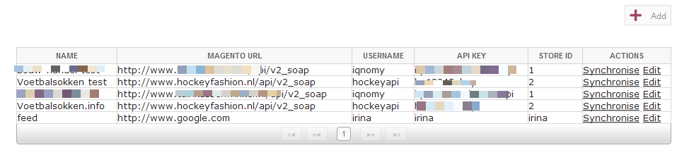

Magento feed detail
~~~~~~~~~~~~~~~~~~~
Add and edit a Magento feed

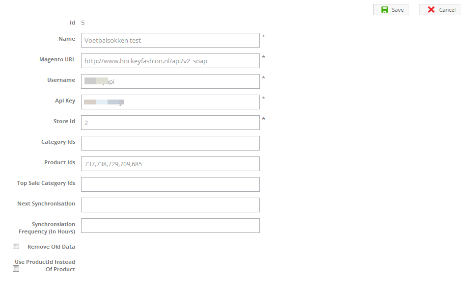

Magento synchronisation status
~~~~~~~~~~~~~~~~~~~~~~~~~~~~~~

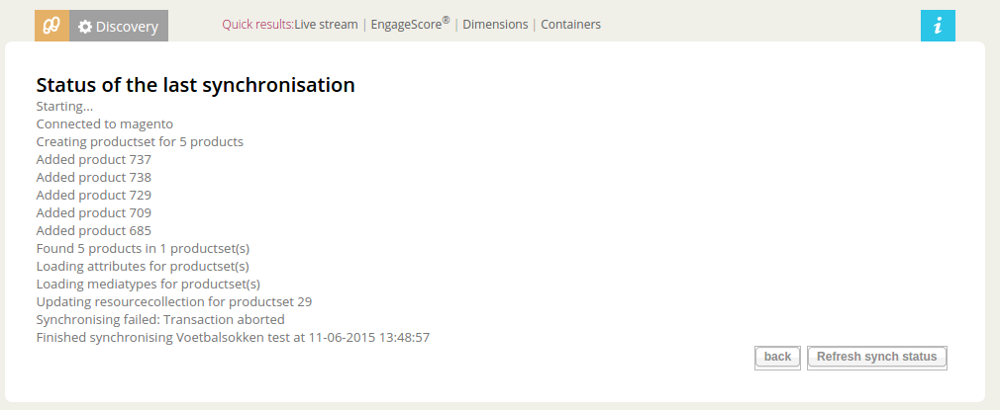

Magento synchronisation history
~~~~~~~~~~~~~~~~~~~~~~~~~~~~~~~

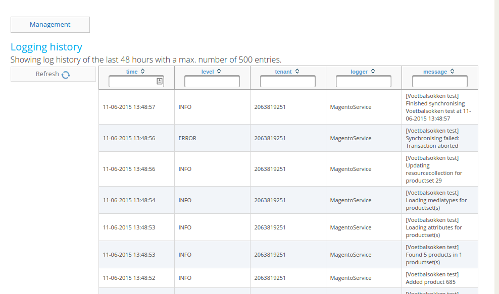

Webresources overview
~~~~~~~~~~~~~~~~~~~~~

Webresource detail
~~~~~~~~~~~~~~~~~~

Webresource property detail
~~~~~~~~~~~~~~~~~~~~~~~~~~~

CSV import
~~~~~~~~~~

Create manual resource collection
~~~~~~~~~~~~~~~~~~~~~~~~~~~~~~~~~

*************
Configuration
*************

Connect IQNOMY
==============
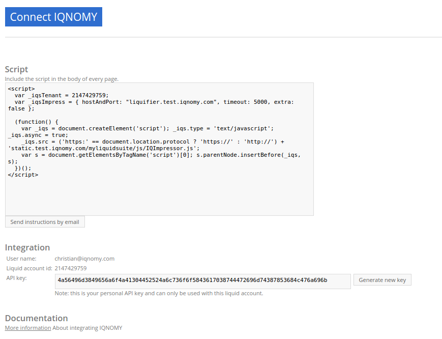

Liquid account
==============

Configuration general
~~~~~~~~~~~~~~~~~~~~~

Users
~~~~~

Websites
========

Websites overview
~~~~~~~~~~~~~~~~~

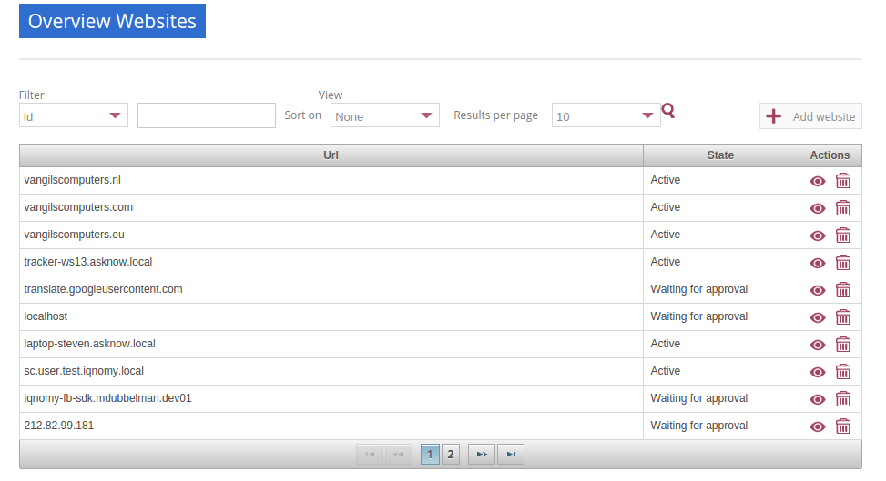

Website configuration
~~~~~~~~~~~~~~~~~~~~~

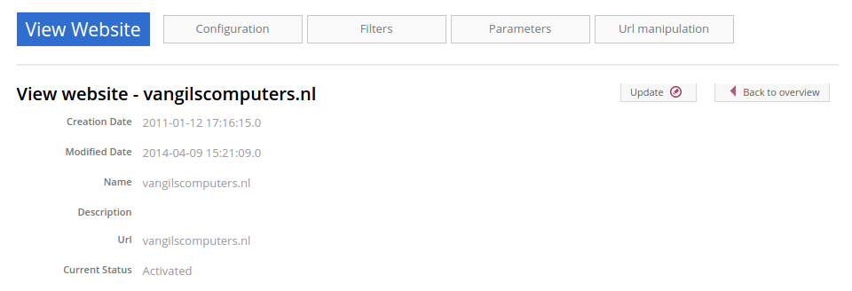

Website filter
~~~~~~~~~~~~~~

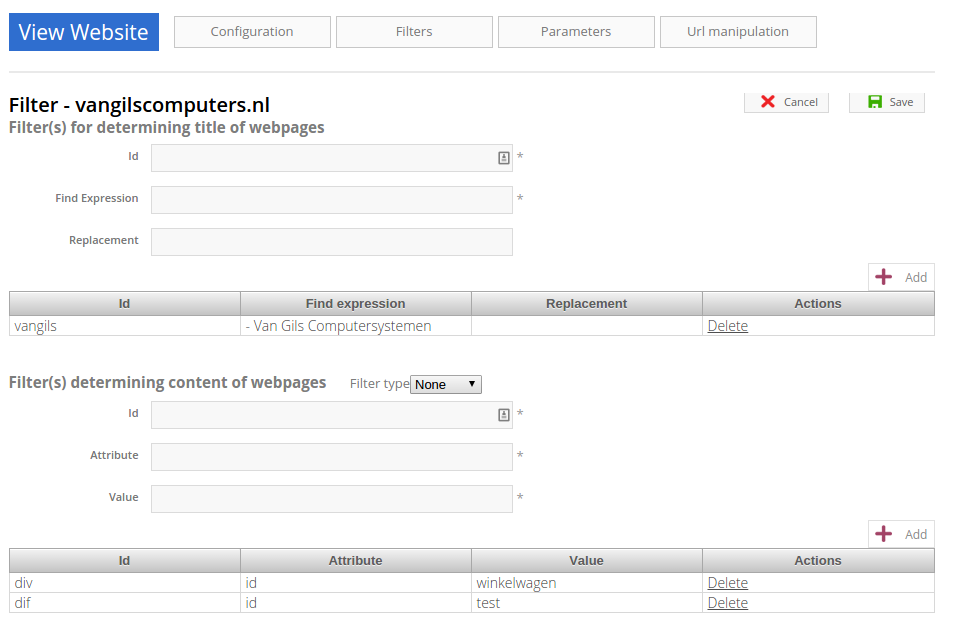

Website parameters
~~~~~~~~~~~~~~~~~~

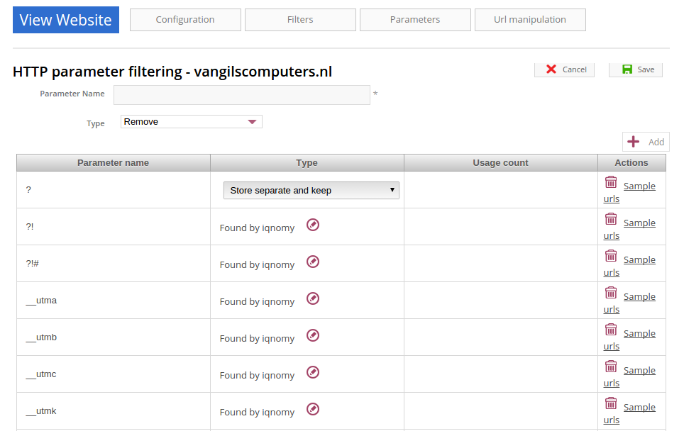

Parameters in URLs
++++++++++++++++++

When we track URLs as a pagevisit. There are a lot of parameters in these urls.

Parameters are the key/values in an url. A parameter is recognized by ?, # or &. Most of the parameters are only there for the website functionality and don't have any meaning for the page url. If you strip them from the URL the page will still show the same page. If a parameter is stripped from the URL, IQNOMY can recognize a pagevisit from different visitors as the same pagevisit.

Example:

* visitor 1 visits http://www.iqnomy.com/?gclid=iowerSDferr435345iwssRFDWERWE
* visitor 2 visits http://www.iqnomy.com/?utm_campaign=google

Actually both visitor visit the page: http://www.iqnomy.com. We have stripped the two parameters to recognize this as the same page. Sometimes the parameter does make a difference in the recognition of the page. Therefor you can configure what to do with the parameters on this page.

Standard IQNOMY has a preconfiguration of found parameters on your site, but you can change the setting for your organization.

After stripping the trackingURL from parameters the 'real' URL is available. This URL is stored as a '[[Resources|Resource]]'.

Type actions
++++++++++++

These are the actions that can be done with a parameter.

With the example of, http://www.iqnomy.com?utm_campaign=google, the type actions are checked.

remove
   http://www.iqnomy.com will be stored as the visited page

store separate and remove
   http://www.iqnomy.com will be stored as the visited page and utm_campaign=google will be stored with this pagevisit.

store separate and keep
   http://www.iqnomy.com?utm_campaign=google as the visited page and utm_campaign=google will be stored with this pagevisit.

store separate and keep, clear value
   http://www.iqnomy.com?utm_campaign= as the visited page and utm_campaign=google will be stored with this pagevisit.

search argument
   http://www.iqnomy.com will be stored as the visited page and utm_campaign=google will be stored as a question with this pagevisit.

keep
   http://www.iqnomy.com?utm_campaign=google as the visited page

found by iqnomy
   http://www.iqnomy.com and the utm_campaign=google will be stored with this pagevisit automatically.

Parameter overview
++++++++++++++++++

.. image:: _static/images/ParameterOverview.png

Parameter name
   The parameter name found in a tracked URL.

Type
   The 'type action' shows what will be done with the parameter and value when the IQNOMY platform will recognize this in the URL from a pagevisit.

Usage count
   This will only count when a parameter is only found by IQNOMY and no 'type action' is attached to this parameter.

Actions
   If you click Sample urls a popup will show.

Example urls
++++++++++++

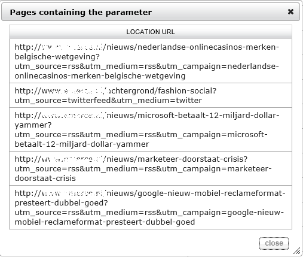

This shows the first 5 urls with this parameter. You can get an impression about how the parameter is used and where it is used.

Edit parameters
+++++++++++++++

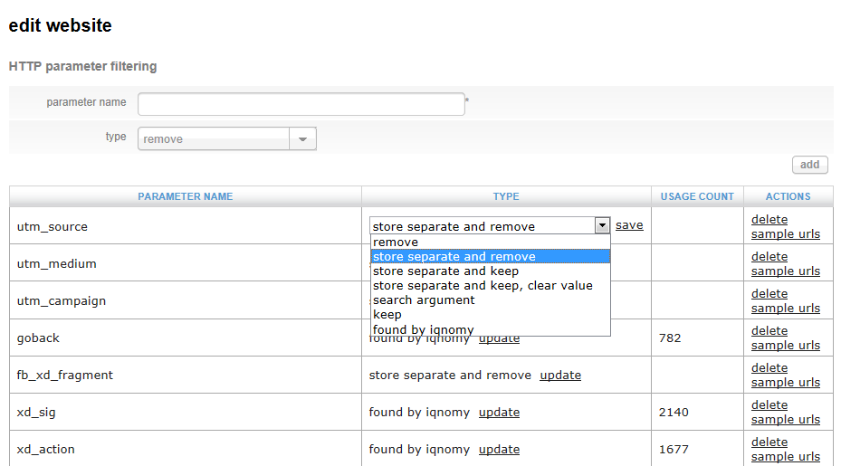

If the Add button is clicked in the screen the parameter is added to the list. Make sure you always click 'save' at the end of the screen to save all your changes.

Delete will delete the parameter from the list, but when the parameter is found with the tracking it will pop up in this list again!

Website URL manipulation
~~~~~~~~~~~~~~~~~~~~~~~~

Type of manipulation
The best way to show this is with some examples. http://www.iqnomy.com/accountinformation/login.php?username=christianvriens

* Delete everything after part of URL: Value=login.php. The URL will become: http://www.iqnomy.com/accountinformation/login.php
* Delete part of URL and everything after: Value=accountinformation. The URL will become: http://www.iqnomy.com/
* Delete everything after start: Value=http://www.iqnomy.com/accountinformation/. The URL will become: http://www.iqnomy.com/accountinformation/

Value
   This is the text that is used for the manipulation recognition. See example above.

Add button
   To add a rule always click add before you click the save button.

Save!
   Don't forget to click save if you have added new rules

Resources
=========

IP-access
=========

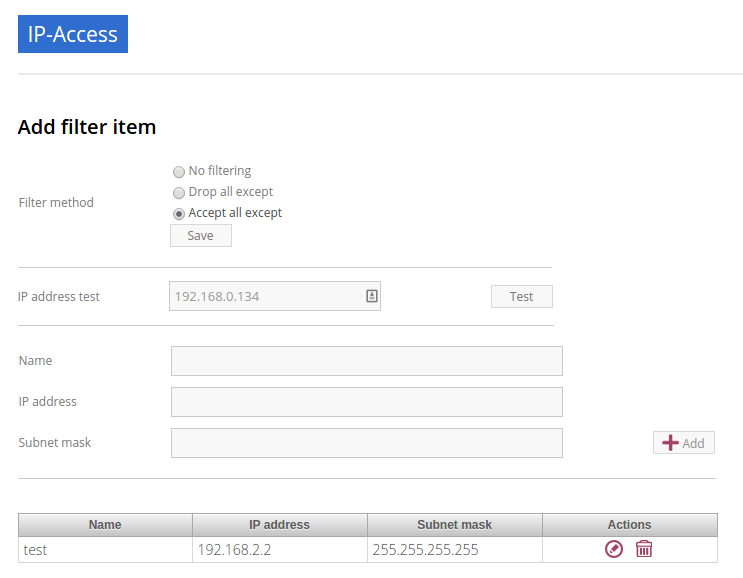

Now it is possible to filter IP address in the following ways: - No filtering - CDrop all except - Accept all except In addition, you now have a range of IP addresses specified using a subnet mask.
Example 1: IQNOMY office externally (clients 193.172.34.65 t / m 193.172.34.78)
* IP Address: 193.172.34.64 Subnet Mask: 255.255.255.240
Example 2: a specific IP address
* IP address: 193.172.34.66 subnet mask: 255.255.255.255 Even IPv6 addresses can be specified.
Example 3: a specific IPv6 address
* IP address: fe80 :: c0f3: 5b08: 37d9: 6e90 subnet mask: fe80 :: c0f3: 5b08: 37d9: 6e90
Example 4: IPv6 range
* IP address: fe80 :: Subnet Mask: fe80 ::

In the maintenance screen of IP filters, you can test whether a specific IP address is allowed based on the set filter method and network. If IP ranges are set in which each IP address explicitly mentioned, they may better be replaced by a new filter with a subnet mask. http://www.subnet-calculator.com/

*******
Reports
*******

Visits of last 30 days
======================

Goal report
===========

URL drilldown report
====================

Custom drilldown report
=======================

