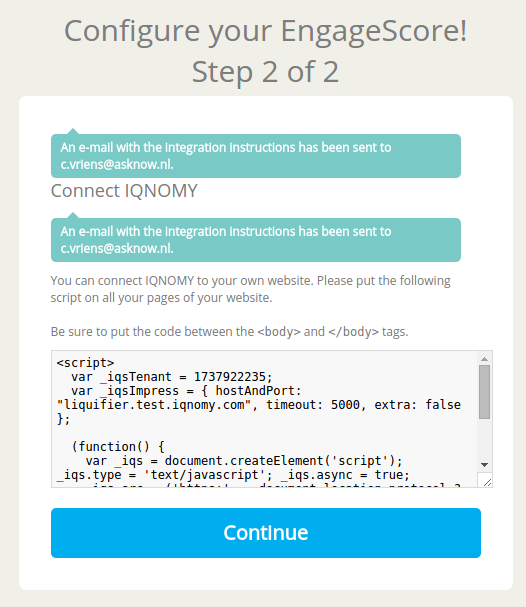
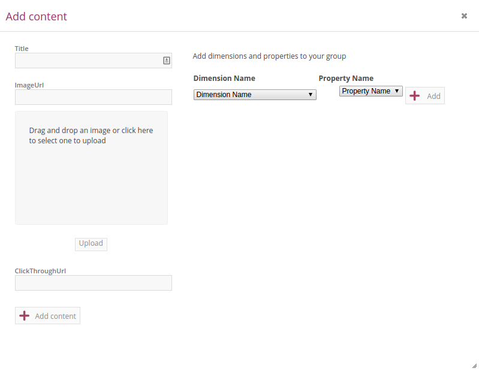
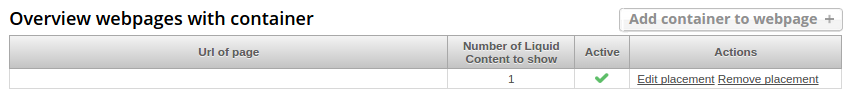
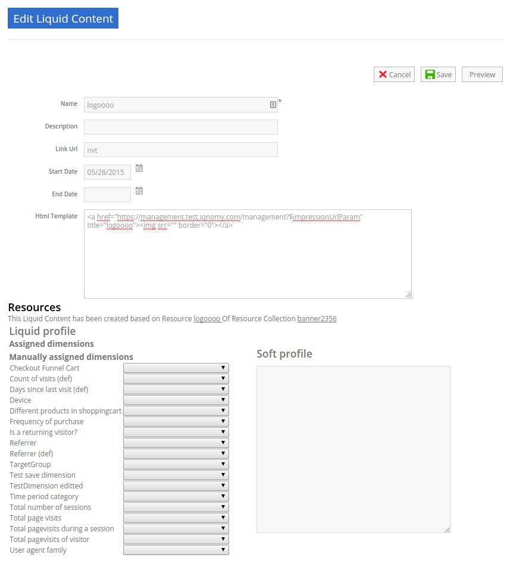

.. include:: ../links.rst

##############
Liquid Account
##############

.. contents::

.. _liquid-account-overview:

Liquid Accounts
---------------

The Liquid Account overview page shows a list of Liquid Account where this user has access to. Every user has a different list on this page. If you want access to an existing Liquid Account you will have to ask for access to the owner.

The overview screen is only available for users that have access to multiple Liquid Accounts. If you don't have this overview screen but want to create a second liquid account. `Contact us`_

By using 'Add Liquid Account' you can create a new liquid account.

Explaining the information in the table

My liquid account
   This shows the list of liquid accounts you have access to
Industry
   The industry where this liquid account is added to.
Account type
   EngageScore Basis, EngageScore plus or Liquid internet
Connected
   A 'V' shows if the liquid account is active. A 'X' represents not active. The date in this column represents the day the first profile was created.
Last login
   the last time this account was accessed by an IQNOMY user
Owner
   shows the emailadress of the owner of the account
Role
   Your role for this liquid account. This can be Owner, Administrator or Reporter
Profiles active
   This shows the number of profiles that are active at the moment of opening this overview
Containers
   Shows the amount of containers available within this account

.. _add-new-liquid-account:

Add Liquid Account
------------------

.. image:: _static/images/AddLiquidAccount.png

Script is send
--------------

Discovery
---------

***********
EngageScore
***********

EngageScore is the part of the platform where you can benchmark your performance with others in your industry. The EngageScore functionality will provide you with performance indicators that you can improve.

EngageScore dashboard
=====================

.. image:: _static/images/EngageScore.png

.. glossary::
   EngageScore
      EngageScore is an unique realtime scoring method based on consumption, interaction and participation.
      In realtime the average engagement of your website visitors will be calculated and compared to the previous week.
      An algorithmic approach is used with maximum score 5.00.

   Your ranking
      Your ranking number shows your position against the total number of IQNOMY members. The ranking is calculated every day at the end of the day.
      You have your overall ranking and the ranking in the industry.
      The ranking shown on the engagescore dashboard is the overall ranking.
      If you want to see your ranking in your Industry.
      Go to the ranking list page.

   Engage Value
      EngageValue indicates the potential value of your website visitors. To each EngagePoint a value of € 0.47 is assigned.
      This value is a variable, it can be adjusted by IQNOMY.
      In future releases it is possible to adjust your own value.

   Visitor ticker
      The visitor ticker shows realtime profiles with there EngageScore. You can click to go to the Live Stream

   Overall EngageScore
      This graph shows your EngageScore in time

   EngagePoints
      The amount of EngagePoints are based on the assists a website visitor is making. Weights are created based on assists on the website.
      For example, page visits will receive a lower rank than someone who is writing a productreview.
      The EngagePoints are compared to the previous week. All the possible assists on your website are taken into account.
      If you are doubting click here to review the assists and adjust them if necessary.

   Average EngageValue
      The amount of EngagePoints are based on the assists a website visitor is making.
      Weights are created based on assists on the website. For example, page visits will receive a lower rank than someone who is writing a productreview.
      The EngagePoints are compared to the previous week. All the possible assists on your website are taken into account.
      If you are doubting click here to review the assists and adjust them if necessary.

   Expected EngageValue
      The expected EngageValue indicates your monetary value compared to the same day in the previous week.

   Industry average EngageScore
      You EngageScore in time benchmarked against you industries average.

   Industry EngageValue
      For explanation EngageValue click the 'i' at EngageValue at the EngageValue box.

EngageScore Insight
===================

.. image:: _static/images/EngageScoreInsight.png

.. glossary::

   Your ranking
      Every night your EngageScore is compare with all the companies in your industry and globally with all other
      IQNOMY users. Based on this you get a ranking.

   Ranking competitors
      Shows the amount of participants in the Ranking list

   Improvements for higher ranking
      Based on your EngageScore calculation IQNOMY provides suggestions to improve your ranking by getting a higher EngageScore.

   Newest members
      The last non-anonymous companies that are using the IQNOMY platform.

Ranking list
============

.. image:: _static/images/RankingList.png

.. glossary::
   Users engagement
      User engagement is defined in a score from 0 to 5, where 5 is high. This score is based on the RFD model.

********
Profiles
********

Website Visitors
================

Follow yourself on your website
IQNOMY will compose visitors profile for every website visitor. How can I look up my own profile? First you need to find your Visitor ID (visitor ID).
Chrome:

#. Go to your website (IQNOMY script has to be implemented)
#. Click right mouse button ‘Inspect element’
#. Select tab ‘Network’
#. Click F5
#. Search URL starting with http://liquifier.iqnomy.com/myliquidsuite-ws/
#. Click on the URL – it will appear on the right side. In the URL you can find a VID = 10 numbers
#. Copy the VID

Live Stream
===========

Follow
======

Dimensions
==========

Rule engine
-----------
The rule engine is used to create the profiles.

Dimensions overview
-------------------

.. image:: _static/images/DimensionOverview.png

Dimensions list
---------------

.. image:: _static/images/DimensionList.png

Edit dimension
--------------

Configuration
+++++++++++++

Properties
++++++++++

.. image:: _static/images/EditProperties.png

Rules
+++++

Add dimension
-------------

Choose type
+++++++++++

.. image:: _static/images/AddDimension.png

Add properties
++++++++++++++

.. image:: _static/images/AddProperties.png

Add rule
++++++++

***************
Liquid internet
***************

Containers
==========

Container conversion
--------------------

.. image:: _static/images/ContainerConversion.png

Container list
--------------

.. image:: _static/images/ContainerList.png

Container who
-------------
Every Container can select the Liquid content based on different matching methods. Depending on the selection method choosen while configuring the container the selector will use a method. You can choose to use for 30% one method and for 70% another. This way the diffent methods can be compaired.

Methods
+++++++

Dimension
    If a marketeer wants to target the container you can use this technique. eg. We target 'prospect' our banner 'get invited'
Semantic
    This will use the txt form the webpage and find liquid content that is similar to this page. Blogs and newssites use this technique which automaticly will find relating webpages without using tagging.
Visitor classification
    Selflearning technique. IQNOMY will learn from visitor behavior and profile which liquid contents are best for this visitor. Every day this will become smarter because it uses the knowledge from all visitors to predict this visitor.
Visitor semantic
    Depending on what the visitor reads IQNOMY finds out what other content is relating to this visitors interests.
Random
    IQNOMY will random show content that is being used in this container. This functionality can be used to compare the results with the other techniques
Fixed
    You use the IQNOMY techniques but want to know what the results would be in the situation that you were using before. We can present a percentage of your visitors with this technique so you can compare the results.

Fallback
++++++++

If a method can't be used the fallback will start. In this escalation only the 'Random' or 'Fixed' method can be choosen.

Container where
---------------
To insert a Liquid Container on a webpage your first have to indicate the location of the placement. Fill in the URL of the site and view the webpage. You can hover over the various parts of the website. Click on the content box where you would like to place the Liquid Container. Copy the xpath expression that appears. Finally choose the number of Liquid Content to show 1 is standard.

.. image:: _static/images/ContainerWhere.png

.. image:: _static/images/AddLocation.png

Container how
-------------

.. image:: _static/images/ContainerHow.png

Container what
--------------

.. image:: _static/images/ContainerWhatContent.png

Container summary
-----------------

Container fixed content
-----------------------

.. image:: _static/images/FixedLiquidContent.png

Container report general
------------------------

Container report content
------------------------

Pageplacement overview
----------------------

Pageplacement detail
--------------------

.. image:: _static/images/PageplacementDetail.png

Liquid content
==============

Liquid content overview
-----------------------

Liquid content detail
---------------------
This is the edit/add and view screen of one liquid content

Resource collection
===================

Resource collections overview
-----------------------------

.. image:: _static/images/ResourceCollectionsOverview.png

Resource collection content overview
------------------------------------

Resource collection content detail
----------------------------------

Attributes overview
-------------------

.. image:: _static/images/AttributesOverview.png

Attribute detail
----------------

.. image:: _static/images/AttributeDetail.png

Magento feeds overview
----------------------

.. image:: _static/images/MagentoFeedsOverview.png

Magento feed detail
-------------------
Add and edit a Magento feed

.. image:: _static/images/MagentoFeedDetails.png

Magento synchronisation status
------------------------------

.. image:: _static/images/MagentoSynchronisationStatus.png

Magento synchronisation history
-------------------------------

.. image:: _static/images/MagentoSynchronisationHistory.png

Webresources overview
---------------------

.. image:: _static/images/WebresourceFeeds.png

Webresource detail
------------------

Webresource property detail
---------------------------

CSV import
----------

.. image:: _static/images/ResourceCollectionImportCSV.png

Create manual resource collection
---------------------------------

Feeds overview
--------------

.. image:: _static/images/FeedsOverview.png

Feed detail
-----------

.. image:: _static/images/FeedDetail.png

*************
Configuration
*************

Connect IQNOMY
==============

.. _liquidaccountdetails:

Liquid account
==============

Configuration general
---------------------

General

Your IQNOMY ID
    Id of this tenant. You use this id in the webservices or Tracking integration with website
Company Name
    Name of your MyLiquidSuite. This name is visible when logging in and choosing your MyLiquidSuite. You can have multiple MyLiquidSuites.
Description
    Text field to describe your MyLiquidSuite
Image URL
    URL of the image used in the dropdown in the top of your screen.
Industry
    Those industries are the industries your accounts are active in.
Active
    Is your MyLiquidSuite Active.
In ranking
    Option anonymous or with companyname in ranking.

Configuration

Currency
    You can configure this for your EngageScore Dashboard and Engagement calculations
Budget website
    The yearly budget you have for your website. This is used to calculate your Return on Investment that is shown in the Realtimedesk
Target Engagement
    This shows the goal economical value for your website on a weekly base. In the Engagement chart this is the straight line shown.
Expected visitors per day
    How many visitors you want to reach per day. This is used to calculate in the realtimedesk if you achieved your goal.
Content update
    You can set how often IQNOMY visits your website to update the content. You can filter these visits in your website statistics Filter IQNOMY
Thumbnail update frequency
    You can set how often IQNOMY visits your website to update the thumbnails. You can filter these visits in your website statistics Filter IQNOMY

Users
-----
.. image:: _static/images/LiquidAccountUsers.png

Websites
========

Websites overview
-----------------

.. image:: _static/images/OverviewWebsites.png

Website configuration
---------------------

.. image:: _static/images/WebsiteConfiguration.png

Website filter
--------------

Filtering is used to recognize the content on a webpage. If the content is not inserted through webservices, the platform will collect the content by visiting the URL. When a URL is opened the total HTML is being downloaded to process. This processing is called parsing.

The parser strips the downloaded HTML from irrelevant information by using the filters. There are two types of filters:
* Title filter
* Content filter

Title filter
++++++++++++
The title filter can be used to adjust the title of the page. To be recognized in searchengines the companyname is usually added to the title. In the examples the standard title item is shown in 'bold'.

* IQNOMY news - Liquid Internet platform collected over 200 million profiles
* IQNOMY | Contact
* Contact | IQNOMY
* Liquid Internet platform collected over 200 million profiles | IQNOMY News

Rules to filter the title

In the examples above the bolded parts have to be removed. This can be done by regular expressions. Three things have to be

ID
    name of this filter. You can use any recognizable name you like
Find expression
    here you use the regular expression to recognize the part of the title
Replacement
    this is the txt you want to put into the part that's being recognized by the regular expression.

Examples for regular expressions

.. note::
    IQNOMY news - Liquid Internet platform collected over 200 million profiles

    ID
        Replace IQNOMY news -
    Find expression
        \AIQNOMY news -
    Replacement
        New title: 'Liquid Internet platform collected over 200 million profiles'

.. note::
    IQNOMY | Contact

    ID
        Filter IQNOMY | from title
    Find expression
        \AIQNOMY \|
    Replacement
        New title: 'Contact'

.. note::
    Contact | IQNOMY

    ID
        Delete | IQNOMY
    Find expression
        \| IQNOMY\Z
    Replacement
        New title: 'Contact'

.. note::
    Liquid Internet platform collected over 200 million profiles''' | IQNOMY News'''

    ID
        iqnomy news
    Find expression
        \| IQNOMY News\Z
    Replacement
        New title: 'Liquid Internet platform collected over 200 million profiles'

.. warning::
    is a special character in a regular expression. To be recognized as a character you have to use \ in front of \|.

Content filters
+++++++++++++++
Content filters are used when the Visitor profile shows content that isn't the main content from. Also you can see the stripped content at the Resources. If this isn't the right content you can use filtering.

.. image:: _static/images/WebsiteFilters.png

Title filter

id
    The name that you want to give to this filter

Find expression
    In find expression you can use Regular expressions to manipulate the title of the webpage. The title of a webpage is recognized by the W3C title tag.

Replacement
    Depending on the regular expression you can put the replace text here.

Table
    This shows the already used filters.

Action delete
    This will delete the filter. Note: you also have to click the save button at the end of the page.

Content filters

Include / Exclude
    This filtertype is set for all the content filters in use!

Website parameters
------------------

.. image:: _static/images/WebsiteParameters.png

Parameters in URLs
++++++++++++++++++

When we track URLs as a pagevisit. There are a lot of parameters in these urls.

Parameters are the key/values in an url. A parameter is recognized by ?, # or &. Most of the parameters are only there for the website functionality and don't have any meaning for the page url. If you strip them from the URL the page will still show the same page. If a parameter is stripped from the URL, IQNOMY can recognize a pagevisit from different visitors as the same pagevisit.

Example:

* visitor 1 visits http://www.iqnomy.com/?gclid=iowerSDferr435345iwssRFDWERWE
* visitor 2 visits http://www.iqnomy.com/?utm_campaign=google

Actually both visitor visit the page: http://www.iqnomy.com. We have stripped the two parameters to recognize this as the same page. Sometimes the parameter does make a difference in the recognition of the page. Therefor you can configure what to do with the parameters on this page.

Standard IQNOMY has a preconfiguration of found parameters on your site, but you can change the setting for your organization.

After stripping the trackingURL from parameters the 'real' URL is available. This URL is stored as a '[[Resources|Resource]]'.

Type actions
++++++++++++

These are the actions that can be done with a parameter.

With the example of, http://www.iqnomy.com?utm_campaign=google, the type actions are checked.

remove
   http://www.iqnomy.com will be stored as the visited page

store separate and remove
   http://www.iqnomy.com will be stored as the visited page and utm_campaign=google will be stored with this pagevisit.

store separate and keep
   http://www.iqnomy.com?utm_campaign=google as the visited page and utm_campaign=google will be stored with this pagevisit.

store separate and keep, clear value
   http://www.iqnomy.com?utm_campaign= as the visited page and utm_campaign=google will be stored with this pagevisit.

search argument
   http://www.iqnomy.com will be stored as the visited page and utm_campaign=google will be stored as a question with this pagevisit.

keep
   http://www.iqnomy.com?utm_campaign=google as the visited page

found by iqnomy
   http://www.iqnomy.com and the utm_campaign=google will be stored with this pagevisit automatically.

Parameter overview
++++++++++++++++++

Parameter name
   The parameter name found in a tracked URL.

Type
   The 'type action' shows what will be done with the parameter and value when the IQNOMY platform will recognize this in the URL from a pagevisit.

Usage count
   This will only count when a parameter is only found by IQNOMY and no 'type action' is attached to this parameter.

Actions
   If you click Sample urls a popup will show.

Example urls
++++++++++++

This shows the first 5 urls with this parameter. You can get an impression about how the parameter is used and where it is used.

Edit parameters
+++++++++++++++

If the Add button is clicked in the screen the parameter is added to the list. Make sure you always click 'save' at the end of the screen to save all your changes.

Delete will delete the parameter from the list, but when the parameter is found with the tracking it will pop up in this list again!

Website URL manipulation
------------------------
.. glossary::
    URL manipulation
        Strip non-valid url's from parts to make them into valid url's

Type of manipulation
The best way to show this is with some examples. http://www.iqnomy.com/accountinformation/login.php?username=christianvriens

* Delete everything after part of URL: Value=login.php. The URL will become: http://www.iqnomy.com/accountinformation/login.php
* Delete part of URL and everything after: Value=accountinformation. The URL will become: http://www.iqnomy.com/
* Delete everything after start: Value=http://www.iqnomy.com/accountinformation/. The URL will become: http://www.iqnomy.com/accountinformation/

.. image:: _static/images/URLManipulation.png

Value
   This is the text that is used for the manipulation recognition. See example above.

Add button
   To add a rule always click add before you click the save button.

Save!
   Don't forget to click save if you have added new rules

Resources
=========

Resources are all the contents (visited pages) that are found by IQNOMY.

Resources overview
------------------

.. image:: _static/images/ResourcesOverview.png

Resource detail
---------------

Location URL
    Domain of the website
Creation - Modified -Retrieve date
    Automatically generated
Text of the Resource
    This content is related to the 'Profile - Wordcloud'. To make the 'Profile' valuable add IQNOMY Filters
Type
    Mostly URL but other options: banner - video - other - all
Name
    Name of the Liquid Internet account
Description
    Mostly autocreated
Tags
    The possibility to add manual tags.

Add resource
------------

.. image:: _static/images/AddResource.png

IP-access
=========

.. image:: _static/images/IpAccess.png

Now it is possible to filter IP address in the following ways: - No filtering - CDrop all except - Accept all except In addition, you now have a range of IP addresses specified using a subnet mask.

Example 1: IQNOMY office externally
    (clients 193.172.34.65 t / m 193.172.34.78)
    IP Address: 193.172.34.64 Subnet Mask: 255.255.255.240
Example 2: a specific IP address
    IP address: 193.172.34.66 subnet mask: 255.255.255.255 Even IPv6 addresses can be specified.
Example 3: a specific IPv6 address
    IP address: fe80 :: c0f3: 5b08: 37d9: 6e90 subnet mask: fe80 :: c0f3: 5b08: 37d9: 6e90
Example 4: IPv6 range
    IP address: fe80 :: Subnet Mask: fe80 

In the maintenance screen of IP filters, you can test whether a specific IP address is allowed based on the set filter method and network. If IP ranges are set in which each IP address explicitly mentioned, they may better be replaced by a new filter with a subnet mask. http://www.subnet-calculator.com/

*******
Reports
*******

Visits of last 30 days
======================

