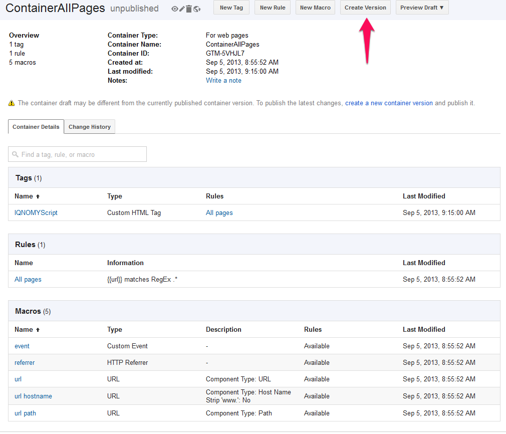
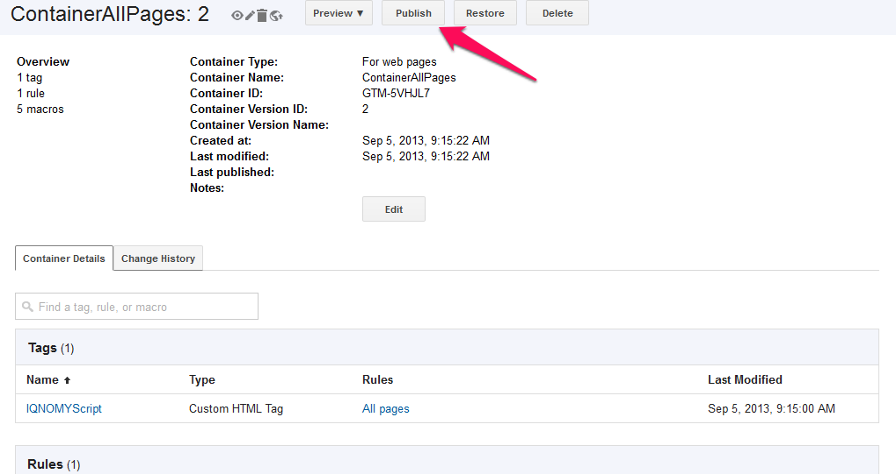
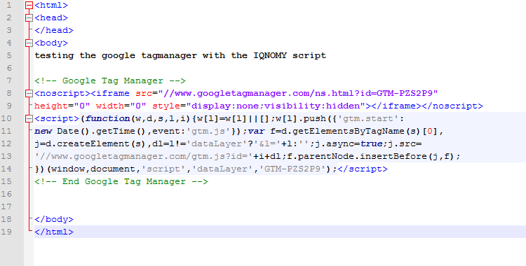

######
Google
######

=================
Google Tagmanager
=================
Using the Google Tagmanager to integrate the IQNOMY script in your website.

.. image:: _static/images/Step1Tag.png

.. image:: _static/images/Step5Tag.png
.. image:: _static/images/Step6Tag.png

=====================
Google event tracking
=====================

Omdat google event niet altijd werd uitgevoerd op de door Google beschreven
manier. Hebben we dit onderzocht.

Vermoedelijk wordt de trackEvent in de onclick afgebroken doordat de link in de href (te snel) gevolgd wordt.
In het verleden heeft dit wel goed gewerkt, mogelijk is er iets veranderd in het Google script (asynchrone trackEvent?) waardoor dit anders is gaan werken.

Na wat zoeken:

http://stackoverflow.com/questions/17361992/google-analytics-events-canceled
https://support.google.com/analytics/answer/1136920?hl=en-GB
https://developers.google.com/analytics/devguides/collection/analyticsjs/advanced#hitCallback

Gezien de bovenstaande artikelen lijkt het alsof we geluk hebben gehad dat het eerder wel gewerkt heeft
Oplossing

De oplossing lijkt om een time-out in te bouwen bij elke link waar trackEvent toegepast wordt.
Zoiets als:

Vermoedelijk wordt de trackEvent in de onclick afgebroken doordat de link in de href (te snel) gevolgd wordt.
In het verleden heeft dit wel goed gewerkt, mogelijk is er iets veranderd in het Google script (asynchrone trackEvent?) waardoor dit anders is gaan werken.

Na wat zoeken:
http://stackoverflow.com/questions/17361992/google-analytics-events-canceled
https://support.google.com/analytics/answer/1136920?hl=en-GB
https://developers.google.com/analytics/devguides/collection/analyticsjs/advanced#hitCallback

Gezien de bovenstaande artikelen lijkt het alsof we geluk hebben gehad dat het eerder wel gewerkt heeft
Oplossing

De oplossing lijkt om een time-out in te bouwen bij elke link waar trackEvent toegepast wordt.
Zoiets als:

.. code-block:: javascript

   

::
   <a href="http://www.example.com" onClick="trackOutboundLink(this, 'Outbound Links', 'example.com'); return false;">

Google Event Tracking
=====================

Er komt een nieuwe versie van analytics, genaamd Universal Analytics. Hier twee voorbeelden van de oude en nieuwe variant.
Classic Analytics ga.js

https://developers.google.com/analytics/devguides/collection/gajs/eventTrackerGuide?hl=nl
Specification:

::
   _trackEvent(category, action, opt_label, opt_value, opt_noninteraction)

Example:

::
   <a href="#" onClick="_gaq.push(['_trackEvent', 'Videos', 'Play', 'Baby\'s First Birthday']);">Play</a>

Universal Analytics analytics.js

https://developers.google.com/analytics/devguides/collection/analyticsjs/events?hl=nl
Specification:

::
   ga('send', 'event', 'category', 'action', 'label', value, {'nonInteraction': 1});  // value is a number.

Example:

::
   <a href="#" onClick="ga('send', 'event', 'Videos', 'Play', 'Baby\'s First Birthday');">Play</a>

.. code-block:: javascript

   

::
   <a href="http://www.example.com" onClick="trackOutboundLink(this, 'Outbound Links', 'example.com'); return false;">

=============================
Analytics filter IQNOMY crawl
=============================

To collect content en thumbs of your website IQNOMY visits the URL's from your website. Search engines do the same thing to collect this data. Filter these statistics out of you website statistics based on the useragent ''Iqnomybot''.

IQNOMY analyses your website. The webstatistics application you use can be influenced in the statistics. We perform two actions regarding your website.
#Make a '''thumb''' of your websitepage. This thumb is a small screenshot of your webpage.
#'''Crawl''' content. If a visitor visits our website we get the same URL the visitor has in the browser. You can strip parts of this URL, [[Websites|parameters]], from this URL. Example: A visitor visits IQNOMY's website and asks a question. The URL will be: http://www.iqnomy.com/search/search.php?question=statistics

This is an unique URL and we would get the content and make a thumb of this URL. By stripping the URL's [[Websites|parameters]] IQNOMY has a ''clean'' URL to visit. http://www.iqnomy.com/search/search.php

If you don't do this other applications and your webstatistics can be influenced by the visit of IQNOMY.

'''Iqnomybot as a useragent'''

The 'Iqnomybot' is a so-called useragent. If a website is visited your site receives information from this visitor like browsertype. This browsertype is the useragent. This way a website can provide content suited for this useragent. e.g. Visitors with Internet Explorer 6 and 7 can have a different layout.

Useragent 'Iqnomybot' has also an URL so systemadministrators can see what kind of visitor this is. This way the useragent can be filtered from statistics and applications.

=Filtering in Google analytics=
Google Analytics provides you filter options. Filters are applied to the information coming into your account, to manipulate the final data in order to provide accurate reports. These filters can be set up to exclude visits from particular IP addresses, to report only on a subdomain or directory, or to take dynamic page URLs and convert them into readable text strings.

Google Analytics provides you with three predefined filter types, as well as a number of custom options. [https://www.google.com/support/googleanalytics/bin/answer.py?answer=55593]

==Where to find the filters?==
[[File:CreateFilter.png|400px]]
''Click on image to enlarge''

==Filter configuration for IQNOMY==

* Custom filter
* Exclude
* Visitors ISP Organization
* asknow solutions b.v.
* Case sensitive: no
* And select you website profile.

See image below for configuration.

[[File:Filter.png|600px]] 
''Click on image to enlarge''
