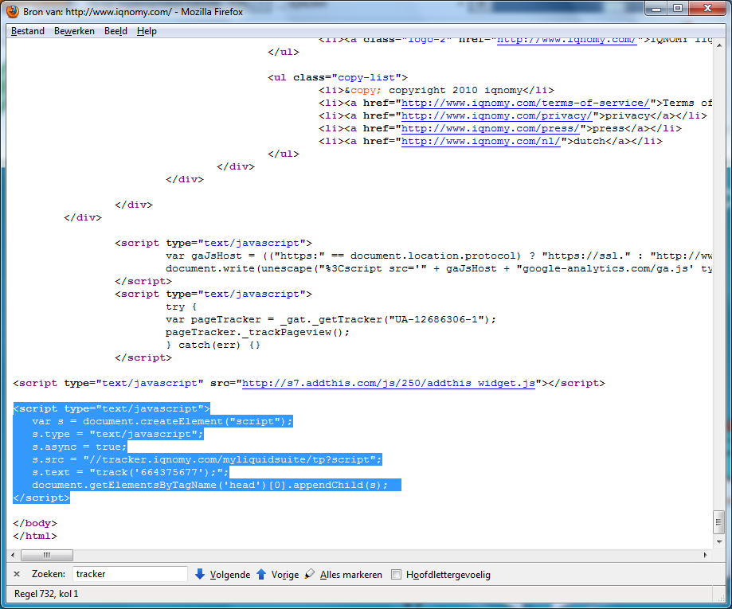
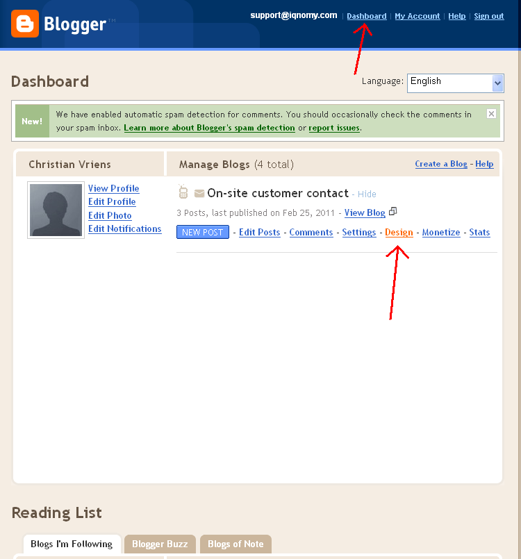
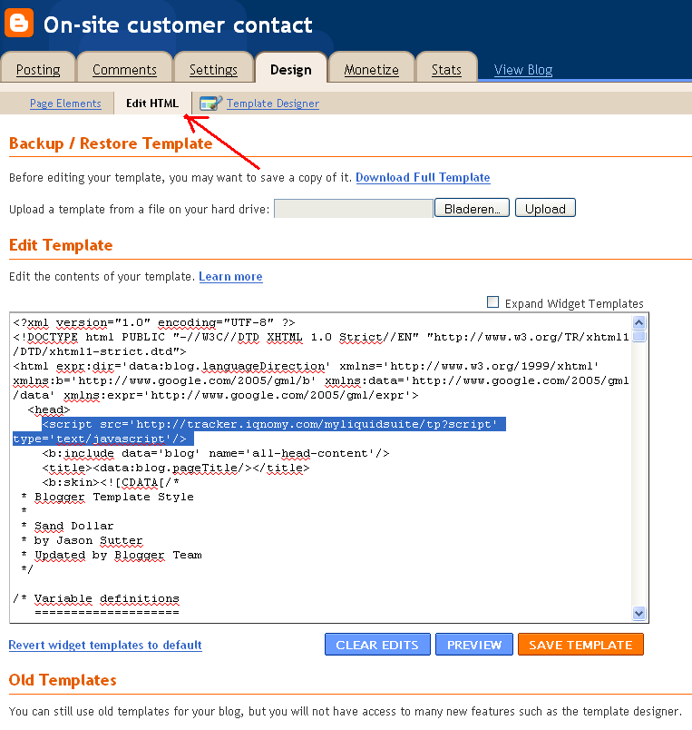
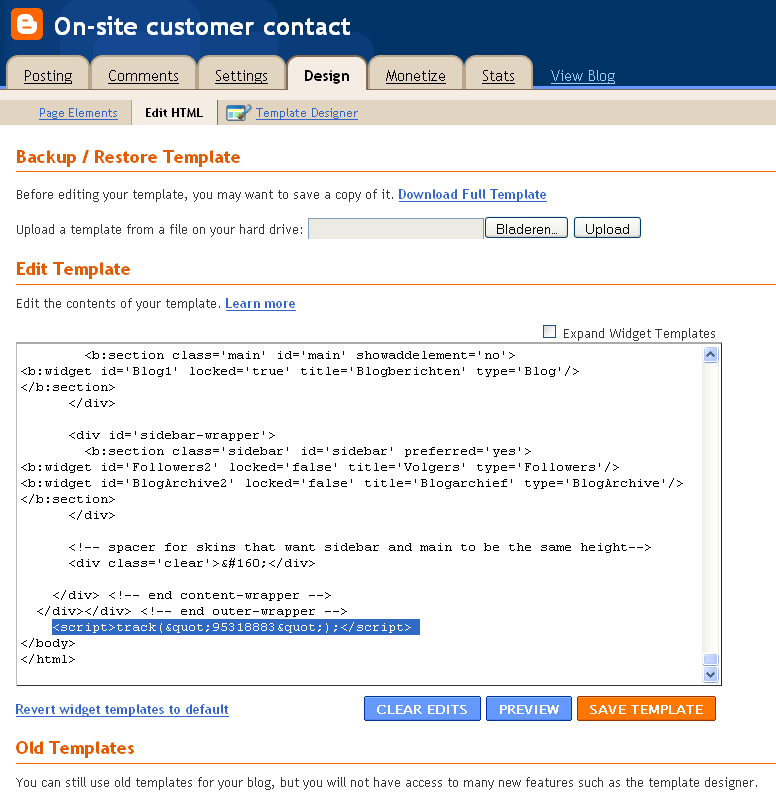

########
Tracking
########

.. contents::

************************
Tracking Code Quickstart
************************

The basic script should be on every website page

.. code-block:: javascript

    

.. note::
   On the XXXXXXX should be your unique Liquid Account id.

Using the script for Liquid Internet
====================================

You can use the script for liquid internet without doing any other integration with your website code. 

**********************
Customizing the script
**********************

Client side liquid internet
===========================

Client site the liquid container. You need to put the container id and the xpath id in the script. 

.. code-block:: javascript
   :linenos:

   

Tracking mailto
===============

* JQuery in the page header, example use the next rule in the <head> of the page:

::

   

* Put in the iqnomy script the next variable:

::

   var iqTrackMailto = true; 

Synchronous script
==================

The standard script is asynchronous. But you can make it synchronous.

Change in the basic script _iqs.async = true to _iqs.async = false
	
Website listener
================

Data in the webform is send when the form is submitted. 

JQuery should be loaded, so put it in the page header:

::

   

Set script variable '_iqTrackForm' as 'true'

.. code-block:: javascript

   

External visitor id
===================

Read more: Identifying iqnomy visitors using custom id

Extra custom javascript script
==============================

We can add extra custom javascript with the existing script. To get this extra javascrip you need to add an extra rule with the existing script. 

:: 

   var _iqsExtra = true;
 
.. warning::

   Pay attention: before adding this rule the script needs to be available on the IQNOMY servers. You can check this with the URL:
 
::

   http://static.iqnomy.com/myliquidsuite/js/tnt/pre_<tenantId>.js
 
 
 
*Complete example*
.. code-block::

   

********************
Script functionality
********************

Xpath finder
============

Solution
An URL extended with a link where the user can open the webpage to select the location of the page.

An url-argument is automatically added to the url iqxpselect=true, this will trigger the xpath-selection javascript included in the impression-script.

Preview with underline
======================
Add the parameters:
iqprvw and iqprvwborder to your url.

.. note::
   iqprvw=(containerid):(liquidcontentid):(xpath)

Example:

::
   URL?iqprvw=1791:16608://div[@id="liquid"]&iqprvwborder=1

API
===

.. todo::

   Read more in the integration

You can also make use of the IQNOMY api and create your own javascript plugin. For more information contact support@iqnomy.com

.. seealso::

   Script implementation tutorials
   Integration
   Container_script
   Identifying_iqnomy_visitors_using_custom_id

######
Script
######

Standard tracking script implementation
=======================================

Standard implementation of the script can be done by a webmaster. He will implement the script in the source code of your website. Normally this is done in a website template. 

 The script will only work when implemented on every page where you want to follow visitors.

BODY script
===========

Make sure the BODY script is placed in between the body tags. Normally a tracking script is being implemented just before the </body>.  

Every BODY script has a customer specific number! Yours is in the email you receive after registering a MyLiquidSuite.
 
Check if the script is implemented
==================================

If the standard script is implemented you can check this yourself by opening your website in you browser. Right-click your mouse and open 'source website'. 

When you see the source of your website you can check by search in this txt for 'iqnomy'. If you search in the txt for 'iqnomy' this will show you the BODY-script. 

If IQNOMY tells you that you are still not connected check if the number in the BODY-script is the same as the number in [[Integration_on_own_website]]. Still problems then email us at [mailto:support@iqnomy.com support@iqnomy.com]

*********
Tutorials
*********

Implementation Google's blogger.com
===================================

A lot of blogs are registered on Google's blogger.com.

If you login you will have a URL like http://''yourname''.blogspot.com. When adding your site in IQNOMY register the site ''blogspot.com''. We use this to verify your script. At the moment we can only verify domainnames and not subdomains like yourname.blogspot.com. After registering at IQNOMY you will receive your own script by email to put on your blog. IQNOMY will then follow the visitors only on your blog. 

To put the script into you blogspot blog. 

Step 1
------

Login your blogspot and click on 'design'.

Step 2
------

Put the IQNOMY script into the HTML code.
 We couldn't edit our sjablones in the browser. Therefore we had to download our blogspot sjablones.
 Put the script in and upload again. I don't know if this is a bug in blogspot. 

Header script (used in old version IQNOMY)===
After uploading it looks like this (part of the script in the <head>):

Body script
-----------

and scrolling down (other part of the script in the <body>):

Conclusion and how to use

*********************
Cross domain tracking
*********************

Companies can use there own identification accross domains. [[Identifying_iqnomy_visitors_using_custom_id]] Also the IQNOMY id can be used accross domains. 

Usage
=====

When you are on the www.vangilscomputer.nl and click a link that goes to the domain www.vangilscomputers.com. This is a different domain.

Add the new function IQImpressor.linkVisitor(this); to a onclick event of a link:

::
   <a href="http://www.vangilscomputers.com/" onclick="IQImpressor.linkVisitor(this);">www.vangilscomputers.com</a>

When the user clicks on the link, this function will add two query-parameters to the url of the link, example: http://www.vangilscomputers.com/?&_iqnomyvids=1234&_iqnomyfids=4.

On the target page, these parameters will be read by our script and will create two session cookies with these values.
Our impression-script will prefer to use the visitor-id/follow-nr from the session cookies.

The function linkVisitor(obj) accepts different types of the obj param.

* For an a href-object, it will use the a.href field to manipulate the url.
* For a form-object, it will use the form.action field to manipulate the url.
* For a string-object, it will append the parameters to the string.
* In all cases, it will return the manipulated url when succeeded.

Considerations
==============

* both domains should be approved in the website-list (like always)
* both domains should contain the same integration script with the same tenant-id
* the visitor will be followed across the other domain for this session only.
* link with a hash-character might not work correctly
* might conflict with other scripts on the website

.. note::
   It can conflict with _gaq.push() when setAllowLinker=true is used in the Google script.

****************
Filter IP adress
****************
`Go to Advanced|exclude IP-addresses to track

Deze setting filtert bezoekers op de website. Na het instellen van een filter zal het na ongeveer 10 minuten gaan werken ivm caching van de deze filters door de server.

Nu is het mogelijk om op de volgende manieren te filteren op ip-adres:
- Niet filteren
- Sluit alle ip-adressen uit behalve de geconfigureerde ip-adressen
- Accepteer alle ip-adressen behalve de geconfigureerde ip-adressen

Daarnaast kun je nu een range van ip-adressen opgegeven d.m.v. van een subnetmask.

* Voorbeeld 1: IQNOMY kantoor extern (clients 193.172.34.65 t/m 193.172.34.78)

IP-adres: 193.172.34.64
subnetmasker: 255.255.255.240

* Voorbeeld 2: één specifiek IP-adres

IP-adres: 193.172.34.66
subnetmasker: 255.255.255.255

Ook kunnen IPv6 addressen opgegeven worden.

* Voorbeeld 3: één specifiek IPv6-adres

IP-adres: fe80::c0f3:5b08:37d9:6e90
subnetmasker: fe80::c0f3:5b08:37d9:6e90

* Voorbeeld 4: range IPv6

IP-adres: fe80::
subnetmasker: fe80::

In het onderhoudsscherm van ip-filters kun je testen of een specifiek ip-adres wordt toegelaten o.b.v. de ingestelde filtermethode en netwerk.

Indien er ip-ranges ingesteld zijn waarbij elk ip-adres expliciet genoemd is, kunnen deze beter vervangen worden door een nieuw filter met subnetmasker.

http://www.subnet-calculator.com/

