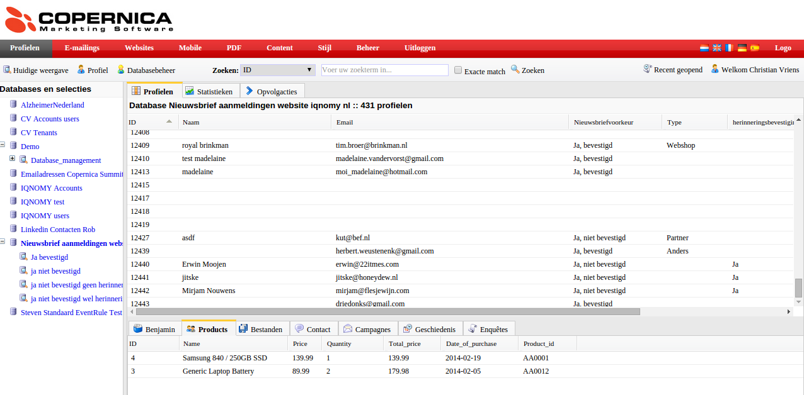

.. index:: Copernica

.. include:: ../links.rst

#########
Copernica
#########

Why would you integrate IQNOMY with Copernica? To have the best up to date profiles in Copernica.

Integration case
================
This IQNOMY customer has integrated IQNOMY with their Copernica account.

Their **goal**: Send personal emails based on the website visit

What is the case
----------------

#. All customers get a newsletter: The links have Copernica id's
#. Customers click on the link: Now we can recognize a Copernica visitor on the website
#. Customer searches on the website: All data is send to IQNOMY
#. At the end of a visit IQNOMY sends the info to Copernica
#. Based on the data and marketing goals Copernica will send an email

.. figure:: _static/images/WebsiteHolidayCars.png
   :scale: 50 %
   :alt: Visitor searches on website

.. figure:: _static/images/Holidaycars.png

.. image:: _static/images/SearchDate.png

How to implement this case
--------------------------
#. You need an :doc:`IQNOMY <../starthere/gettingstarted>` and Copernica account
#. :ref:`Configure the Copernica <copernica_configuration>` newsletters and database
#. IQNOMY will configure the integration
#. Test your new integration
#. Send your customers personalized emails

.. _copernica_configuration:

Copernica configuration
~~~~~~~~~~~~~~~~~~~~~~~
* Put the Copernica id in the links of all your newsletters with the prefix iqcopid

::
   http://www.uwdomein.com/?iqcopid=12313248234
   http://www.uwdomein.com/index.php?utm_medium=email&iqcopid=12383463

.. warning::
   Within every Copernica database a customer has a different Copernica ID. So emailadres is not a Copernica id.

* Get the database id and Copernica api key
* Configure the database fields based on the information you want from the website.

.. seealso::
   * `Liquid email marketing cases`_
   * `Introductie in liquid email marketing`_
   * `Ook alle IQNOMY informatie in jou systemen`_

Een andere manier voor de identificatie met Copernica is het inschrijven op de website. Als de inschrijving wordt gedaan door middel van IQNOMY's leadgeneration dan zorgt IQNOMY bij het inschrijven voor de nieuwsbrief ervoor dat de gebruiker wordt herkend met de Copernica id.
Inrichting Liquid Internet
Afhankelijk van de Email marketing case wil je ook liquid internet toepassen op je website. Op basis van de bespreking met IQNOMY voor de case wordt bepaald wat er moet gebeuren om liquid internet toe te passen. 
- Aanmaken container
- HTML invoeren
- Pageplacement: aanpassen container id en bedanktpagina
Op welke pagina's wil je liquid internet beschikbaar hebben en op welke plaats op de pagina. 
- Preview bekijken
Als de container is ingericht kun je de preview bekijken. 
- Aanmaken van rules. Dit is een actie die alleen door IQNOMY uitgevoerd kan worden
Welke regels IQNOMY moet aanmaken wordt bepaald op basis van de besproken case(s).

Versturen profiel naar Copernica
Inrichting copernica
Afhankelijk van de liquid email marketing case heb je behoefte aan bepaalde informatie in Copernica. 
- Database en velden aanmaken in Copernica
Gegevens doorgeven aan IQNOMY:
- Accesstoken en database id van Copernica.
Deze gegevens worden door IQNOMY gebruikt om het profiel naar de juiste Copernica omgeving en database te versturen. 
- Zijn de velden aangemaakt in het subprofiel of het hoofdprofiel? Deze informatie heeft IQNOMY nodig voor de configuratie.
- Aanpassen van de links in de nieuwsbrief {$id}, zodat het Copernica id wordt doorgegeven.
- Afhankelijk van je emailmarketing case pas je de email flow aan. Bijvoorbeeld een last visit, abandon search of abandon shoppingcart case wil je gebaseerd op het bezoek versturen en niet in een wekelijkse nieuwsbrief.
Inrichting IQNOMY
Om het profiel te versturen worden regels aangemaakt in het IQNOMY platform. Deze regelen het doorsturen van het juiste profiel naar Copernica. Dit is een inrichting die alleen door IQNOMY gedaan kan worden. 
Testen
Bij het testen wordt gekeken of het profiel juist binnenkomt. Hiervoor is een actieve copernica id nodig zodat dit profiel kan worden geupdate. Het testen gebeurd door het id toe te voegen aan de url ?iqcopid={id}
- Komt de data van de website binnen. Zie livestream
Het copernica profiel kan worden opgezocht door in de livestream van IQNOMY een bezoeker te volgen en in het scherm te zoeken op het copernica id. Bekijk of alle data goed wordt ontvangen bij het profiel.
- Komt wordt het profiel in copernica geupdate
Als het profiel er goed uit ziet in de livestream dan moet het aan het einde van de sessie ook worden geupdate in Copernica. Bekijk of 5 minuten na je laatste actie op de website het test Copernica profiel is geupdate. 
- Werkt de liquid internet case goed
Als er een liquid internet case is ingericht bekijk dan de preview of deze er goed uit ziet en of alle links goed zijn.
-.. image:: _static/images/GekochteProducten2.png

 Indien alles goed verloopt kan de gehele case ingezet gaan worden. Let hierbij ook goed op de emailflow inrichting in Copernica.
