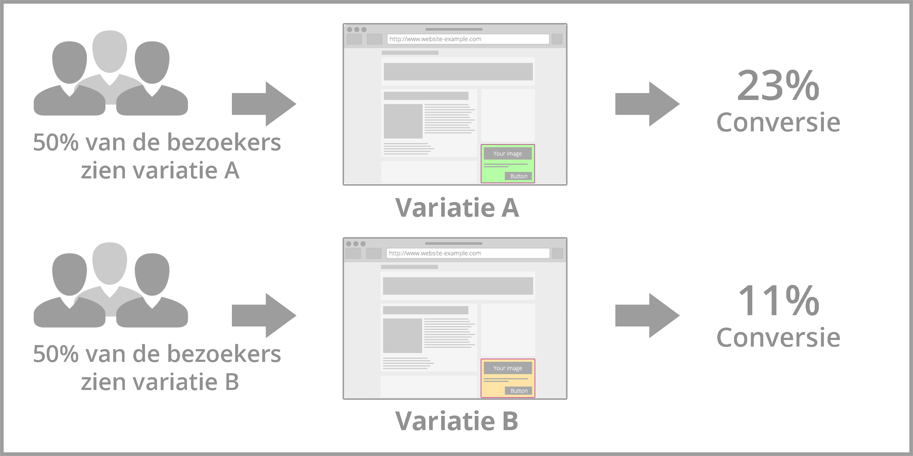
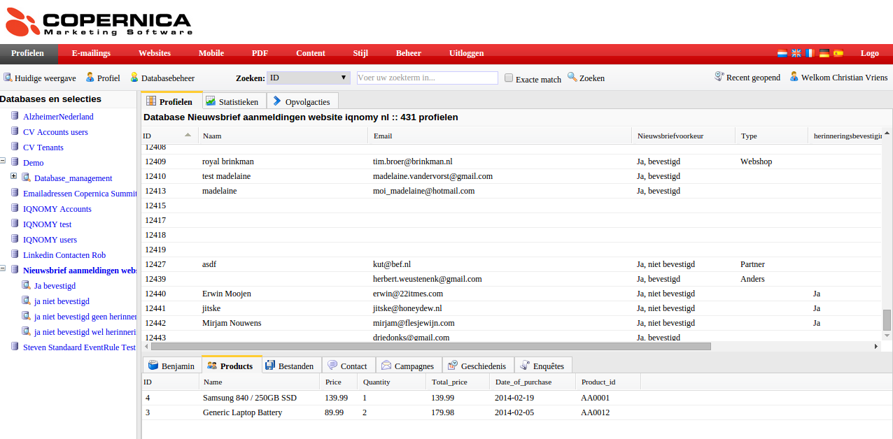

.. todo:: onderstaande text is onduidelijk

Stappenplan voor lead generation
================================

Start die gemaakt kan worden door.
- aanmaken account
- aanmaken container
- html invoeren
- pageplacement: aanpassen container id en bedanktpagina
- preview bekijken
- Database en velden aanmaken in Copernica
Gegevens doorgeven aan IQNOMY:
- Accesstoken en database id van Copernica
- Zijn er veranderingen aan de velden die doorgegeven moeten worden?

Aanmaken van rules(actie IQNOMY):
- Eventrule: meten van de kliks en het tonen
- Eventrule: doorsturen naar copernica met daarin de juiste regels
- Velden bepalen die door worden gestuurd naar copernica
- Dimensie aanmaken: popup gezien

Testen:
- Als alles is ingericht kan er getest worden.
- Indien ok live. Misschien op meerdere pagina's

Opties:
Instellen container methode: AB testen of personalisatie
Bij personalisatie zou het ook nog kunnen dat er extra dimensies
ingericht moeten worden om een doelgroep te herkennen. Dit is meer per site afhankelijk wat we er uit kunnen halen.

AB testing
==========
With A / B testing you research different website designs to get insights in which variant is converting the best. This version is for your website visitors the most attractive. Via A/B testing it is not necessary to get a new homepage immediately. By testing different versions, you choose the best converting version of your current website. A / B testing will be to contribute to a improve sales.

Advantages
----------

* Visitors do not know they participate in a test
* Reliable results that can be easily compared
* Improving the customer experience and relevance

To do's
-------

#. Design content variantions you would like to test among your website visitors
 First consider the target audience you want to reach with your A/B test. All the website visitors who are interested in a special product
 category or all the website visitors that would like to go on vacation in the Summer period.
Every type of content is possible, banners, text, HTML.

#. If you designed the content you need to create your Liquid Container. Go to Discovery, make sure you have a Liquid Internet account. In the Disovery screen, click on Containers. The first step is **Who** choose option: All people and A/B test. Just follow the steps. In the end you will reach the Summary page.

The next thing, is to link the different contents to the specific target group. If you did not create dimensions yet, click **dimensions**. To link and preview your composed Liquid Contents go to **Discovery**, visit **Liquid content** click on the eye icon. Here you can preview and adjust your Liquid Contents. If you click on adjust and scroll down you see all the dimensions. Choose for every Liquid Content the dimension option which is applicable.

 For example you would like to create your A/B test only for website visitors who are interested in the 'Summer vacation'. You have to make a
 dimension which indicates that it's about a Summer vacation. If you open a Liquid Content, you need to connect the Summer to this Liquid
 Content. Because it's an A/B test you have to make sure you have more than one Liquid Content.

Selection method
----------------

The name A/B test says enough about the selection method. IQNOMY works with a selection method of 100%. It is possible to share the 100% in different methods. You can choose to do 50% Personalization and 50% A/B test. It's dependent on the case.

Settings
--------
Go to *Discovery*, visit Containers and go to the Summary page of a container.

.. figure:: _static/images/SelectionMethodLiquidContainter.png

Checklist Liquid Container activation
=====================================

* Selection method.

* LQIID
The landing page after clicking the link needs to have an lqiid parameter. In the liquid content you have to add $impressionUrlParam.

    example: http://www.iqnomy.com?$impressionUrlParam
    example: http://www.iqnomy.com?id=1234&$impressionUrlParam

* Liquid Contents connected to dimensions

*First subscription
==================

Een andere manier voor de identificatie met Copernica is het inschrijven op de website. Als de inschrijving wordt gedaan door middel van IQNOMY's leadgeneration dan zorgt IQNOMY bij het inschrijven voor de nieuwsbrief ervoor dat de gebruiker wordt herkend met de Copernica id.
Inrichting Liquid Internet
Afhankelijk van de Email marketing case wil je ook liquid internet toepassen op je website. Op basis van de bespreking met IQNOMY voor de case wordt bepaald wat er moet gebeuren om liquid internet toe te passen.

* Aanmaken container
* HTML invoeren
* Pageplacement: aanpassen container id en bedanktpagina

Op welke pagina's wil je liquid internet beschikbaar hebben en op welke plaats op de pagina.

* Preview bekijken

Als de container is ingericht kun je de preview bekijken.

* Aanmaken van rules. Dit is een actie die alleen door IQNOMY uitgevoerd kan worden. Welke regels IQNOMY moet aanmaken wordt bepaald op basis van de besproken case(s).

Versturen profiel naar Copernica
================================
Inrichting copernica
~~~~~~~~~~~~~~~~~~~~

Afhankelijk van de liquid email marketing case heb je behoefte aan bepaalde informatie in Copernica.

* Database en velden aanmaken in Copernica

Gegevens doorgeven aan IQNOMY:

* Accesstoken en database id van Copernica.

Deze gegevens worden door IQNOMY gebruikt om het profiel naar de juiste Copernica omgeving en database te versturen.

* Zijn de velden aangemaakt in het subprofiel of het hoofdprofiel? Deze informatie heeft IQNOMY nodig voor de configuratie.
* Aanpassen van de links in de nieuwsbrief {$id}, zodat het Copernica id wordt doorgegeven.
* Afhankelijk van je emailmarketing case pas je de email flow aan. Bijvoorbeeld een last visit, abandon search of abandon shoppingcart case wil je gebaseerd op het bezoek versturen en niet in een wekelijkse nieuwsbrief.

Inrichting IQNOMY
~~~~~~~~~~~~~~~~~
Om het profiel te versturen worden regels aangemaakt in het IQNOMY platform. Deze regelen het doorsturen van het juiste profiel naar Copernica. Dit is een inrichting die alleen door IQNOMY gedaan kan worden.
Testen
Bij het testen wordt gekeken of het profiel juist binnenkomt. Hiervoor is een actieve copernica id nodig zodat dit profiel kan worden geupdate. Het testen gebeurd door het id toe te voegen aan de url ?iqcopid={id}

* Komt de data van de website binnen. Zie livestream

Het copernica profiel kan worden opgezocht door in de livestream van IQNOMY een bezoeker te volgen en in het scherm te zoeken op het copernica id. Bekijk of alle data goed wordt ontvangen bij het profiel.

* Komt wordt het profiel in copernica geupdate

Als het profiel er goed uit ziet in de livestream dan moet het aan het einde van de sessie ook worden geupdate in Copernica. Bekijk of 5 minuten na je laatste actie op de website het test Copernica profiel is geupdate.

*  Werkt de liquid internet case goed

Als er een liquid internet case is ingericht bekijk dan de preview of deze er goed uit ziet en of alle links goed zijn.

.. image:: _static/images/GekochteProducten2.png

 Indien alles goed verloopt kan de gehele case ingezet gaan worden. Let hierbij ook goed op de emailflow inrichting in Copernica.

