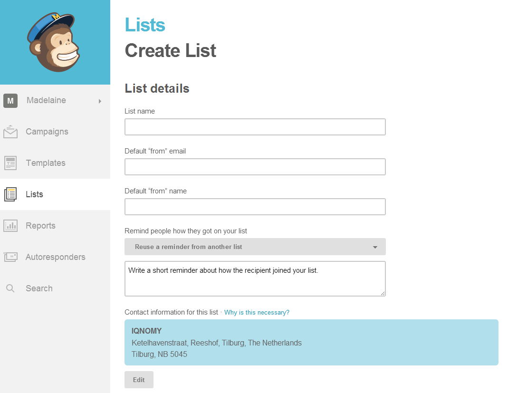
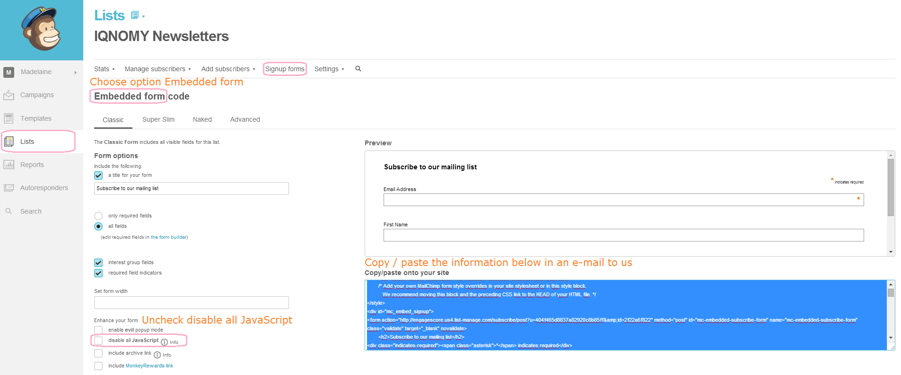

#########
Mailchimp
#########

Steps to

Step 1 create a list
====================

Step 2 create an embedded form
==============================

Add id to URL
=============
email : EMAIL = *|EMAIL|* and LIST:UID = *|LIST:UID|*
euid : EMAIL_UID  = *|EMAIL_UID|* and LIST:UID = *|LIST:UID|*
email_and_euid: EMAIL = *|EMAIL|* and EMAIL_UID  = *|EMAIL_UID|* and LIST:UID = *|LIST:UID|*

http://www.christianvriens.com/test/mailchimp.html?iqmceuid=4659a68892&iqmcliid=5fbb805b61

************************
Stap 1 Lijst beschikbaar
************************

*MailChimp List vereisten*

Om een IQNOMY case te kunnen starten moet er een MailChimp List beschikbaar zijn waaraan subcribers toegevoegd of geüpdatet kunnen worden.
Indien deze nog niet aanwezig is moet er een nieuwe List aangemaakt worden.

Stappen:
1. Inloggen in MailChimp
2. Ga naar menu bar bovenaan aan de pagina en klik op "Lists"
3. Klik op de knop "Create List", aanwezig rechts onder de menu bar boven aan de pagina.
4. In het nieuw verschenen grijze vlak, klik nogmaals op "Create List". (Negeer de optie om een bestaande list te gebruiken)
5. Op de nieuw geopende pagina, vul de vereiste velden in:
6. Wanneer de vereisten velden juist zijn ingevuld, klik op "Save"

Na het volgen van dit stappen plan is er een nieuwe MailChimp "List" aangemaakt waaraan Subscribers kunnen worden aangemeld.

*MailChimp List Fields*

Standaard heeft een (nieuwe) MailChimp List de volgende velden:
* Email Address (vereist, kan niet verwijderd worden. Wordt gebruikt als uniek id)
* First Name (optioneel, kan verwijderd worden)
* Last Name (optioneel, kan verwijderd worden)

Aan een MailChimp lijst kunnen custom velden toegevoegd worden.
*Omdat custom Fields ook standaard in een Signup Form worden opgenomen is het handig om een custom Field standaard onzichtbaar te maken. Zie http://kb.mailchimp.com/lists/signup-forms/add-hidden-fields-to-a-signup-form voor meer info.*

Een custom Field kan je als volgt toevoegen:
* Dit kan via die Signup Forms (editors)
* Dit kan via de List fields settings

Het meest logische is om een custom Field via de List fields settings te onderhouden (toevoegen, wijzigen en verwijderen).

Stappen voor het toevoegen van een custom Field d.m.v. de List field settings:

* 1. Inloggen in MailChimp
* 2. Ga naar menu bar bovenaan aan de pagina en klik op "Lists"
* 3. Selecteer de gewenste List waaran het custom Field toegevoegd moet worden en klik op de naam
* 4. Selecteer de List optie "Settings" en in het dropdown menu klik op "List fields and \*|MERGE|\* tags".
* 5. Klik onderaan de pagina op "Add a field"
* 6. Selecteer het gewenste type voor het custom Field. (TEXT heeft de voorkeur voor IQNOMY profiel properties)
* 7. Indien gewenst wijzig in de nieuw toegevoegd rij, de eigenschappen van het custom Field.
* 8. Klikt onderaan de pagina op "Save Changes" om het toegevoegd custom Field op te slaan.
(Meerdere custom Fields kunnen tegelijk toegevoegd worden op deze manier, alvorens de toegevoegde velden ineen keer op te slaan)

*Let erop:*
*Het lijkt erop dat de List fields en de Signup Form gelinkt zijn aan elkaar zijn. Als je een veld toevoegd aan een List dan wordt deze ook automatisch toegevoegd aan het (standard) Signup Form. Om ervoor te zorgen dat custom Fields niet (bestaande) Signup Forms vervuilen, moet je een toegevoegd custom veld op onzichtbaar zetten.*
* Bij een Signup Form editor selecteer je het invoerveld behorende bij het custom List field, vink Hidden aan en klik op "Save Field".
* Bij het List field settings overzicht, ga naar de rij van het custom List field, vink uit in de kolom "Visible?, Always, en klik op "Save Changes".

*MailChimp List Fields -> Naamgeving*
* *List fields hebben een beschrijvende "Field label" en een "Tag"*
* *De Tag is de systeem naam van een Field en wordt gebruikt binnen het systeem om een Field te herkennen.*
* *Een Field heeft een standaard Tag naam MergeN (waar N een nummer is), automatisch gegenereerd bij het toevoegen van een field.*
* *Een Field kan naast de standaard Tag ook een zelfgekozen Tag krijgen als unieke Tag voor het aangemaakte Field.*
* *De Tag van een Field moet uniek binnen de List zijn.*

Voorbeeld:
Aan List "Onderzoek Integratie MailChimp Met IQNOMY" de volgende custom Fields toegevoegd:

|Field label|Type|Required|Visible|Tag|
|sessionCount|text|false|false|S_COUNT|
|pageVisits|text|false|false|PV_COUNT|
|artikelgroep|text|false|false|ART_GROUP|
\\
Standaard waren de volgende velden al aanwezig:
|Field label|Type|Required|Visible|Tag|
|Email Address|email|always|always|EMAIL|
|First Name|text|false|always|FNAME|
|Last Name|text|false|always|LNAME|

**************
Stap 2 Api key
**************

Stap 2
* Opschrijven met welke api aanroepen de volgende acties uitgevoerd kunnen worden. Per actie moet
api aanroep en de bijbehorende parameters en responses opgeschreven worden.
** Token aanmaken
** Controleren of profiel bestaat
** Profiel ophalen
** Profiel aanmaken
** Profiel updaten
* Deze aanroepen testen met advanced restclient

*Algemene info over MailChimp REST api*
https://apidocs.mailchimp.com/api/2.0/

*Let erop!: API Keys zijn gekoppeld aan een vast datacentrum. Het datacentrum adres moet in de API url als subdomein worden toegevoegd. Wanneer een API key gebruikt wordt die niet matched met het datacentrum zal de API aanroep mislukken! Zie eerste deel API Endpoint MailChimp REST info*
\\
|API Key|8e9f9a5c34667ef2aa9dc25de63d956a4-us8|
|datacentrum|us8|
|voorbeeld url|https://us1.api.mailchimp.com/2.0/lists/list.json|
|resultaat|*mislukt*|
|response|{code}
{
    "status": "error",
    "code": 104,
    "name": "Invalid_ApiKey",
    "error": "Invalid MailChimp API Key: 8e9f9a5c4667ef2aa9dc25de63d956a4"
}
{code}|
\\
|API Key|8e9f9a5c34667ef2aa9dc25de63d956a4-us8|
|datacentrum|us8|
|voorbeeld url|https://us8.api.mailchimp.com/2.0/lists/list.json|
|resultaat|*succes*|
\\

*MailChimp OAuth 2.0*
MailChimp maakt voor het gebruik van OAuth 2.0, als authenticatie voor de REST API.

(https://apidocs.mailchimp.com/oauth2/)

*Profiel aanmaken* https://apidocs.mailchimp.com/api/2.0/lists/subscribe.php

Ter info:

* *Wanneer iemand gesubscribed wordt aan de hand van deze API call krijgt de ingeschreven persoon standaard een bevestigingsmail, met een bevestigingslink. Wanneer de persoon niet klikt op deze link zal hij niet toegevoegd worden aan de List. Dit kan met een parameter uitgezet worden echter kan MailChimp het account suspenden wanneer dit misbruikt wordt. (Niet aangeraden dus)*
* *Wanneer een bestaande subscriber wordt toegevoegd en de update parameter wordt meegegeven wordt de subscriber geupdatet*

************
Stap 3
***********
*New Test instructions:*

1 - Create a MailChimp campaign with a template that has a link with:
* iqmcmail or/and iqmceuid queryparam
* iqmcliid queryparam

You can add them by using the following merge_vars tags combined with the queryparam
|iqmcmail=\*\|EMAIL\|\*|email of the user|
|iqmceuid=\*\|EMAIL_UID\|\* |unique id of the user|
|iqmcliid=\*\|LIST:UID\|\* |unique id of the list the campaign is send from|

*Example:*
{code}
http://www.christianvriens.com/test/mailchimp.html?iqmcmail=*|EMAIL|*&iqmceuid=*|EMAIL_UID|*&iqmcliid=*|LIST:UID|*
{code}

h3. 2 - Enable dimension "Visitors connected with MailChimp"

h3. 3 - Add eventrule for saving visitor basic info (firstname,lastname) when they are added to the eventdata (from queryparams or explicitly by eventparams)
When firstname or lastname is added as a queryparam with a specific value, the values are also updated in MailChimp.
*See step 5.1*

{code}
// service.enableLog();
// service.log("Event - Custom - Event - Custom - Update Visitor basicinfo");
//
// Event - Custom - Event - Custom - Update Visitor basicinfo
//
// Save
// none
//
// Use
// none
//
// Relation

var logPrefix = "Event - Custom - Event - Custom - Update Visitor basicinfo - ";

var email = service.getEventProperty('email');
var firstname = service.getEventProperty('firstname');
var lastname = service.getEventProperty('lastname');

if(!StringHelper.isEmpty(email)){
	service.setVisitorProperty("iqVisitorEmail",email);
}
if(!StringHelper.isEmpty(firstname)){
	service.setVisitorProperty("iqVisitorFirstName",firstname);
}
if(!StringHelper.isEmpty(lastname)){
	service.setVisitorProperty("iqVisitorLastName",lastname);
}
return null;
{code}

h3. 4 - Add dimensionrule for updating MailChimp contact with IQNOMY info.
Before saving the rule, replace $\{testdimensionid1\} and $\{testdimensionid2\} with a id (e.g. 1234l -> l for long) of a dimension of the tenant the rule is added to!

h3. 5 - Click the on the link send by the MailChimp campaign to go to the tenants page and to connect the visitor as MailChimp within IQNOMY

h3. 5.1 - (Optional) Generate a pagevisit with the queryparams firstname or lastname to set the visitors firstname and/or lastname

e.g. If the tenants website is www.tenantwebsite.nl -> go to the url www.tenantwebsite.nl\?firstname=test1&lastname=test2 in your browser
You can change the test1 and test2 to any value you like