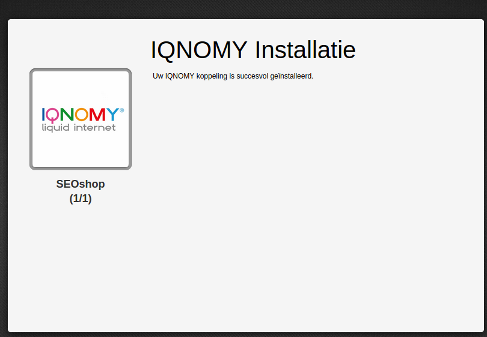
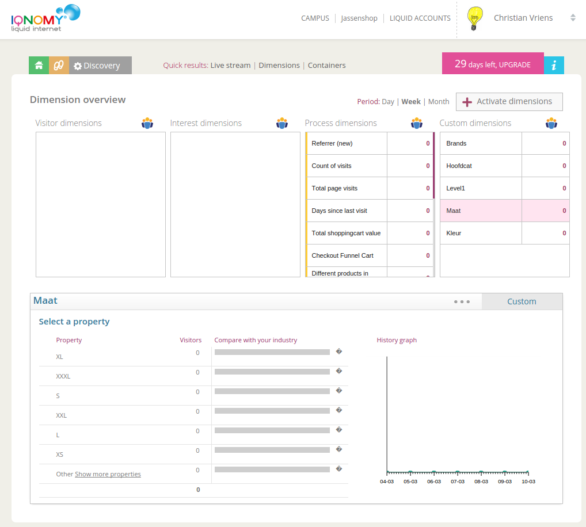
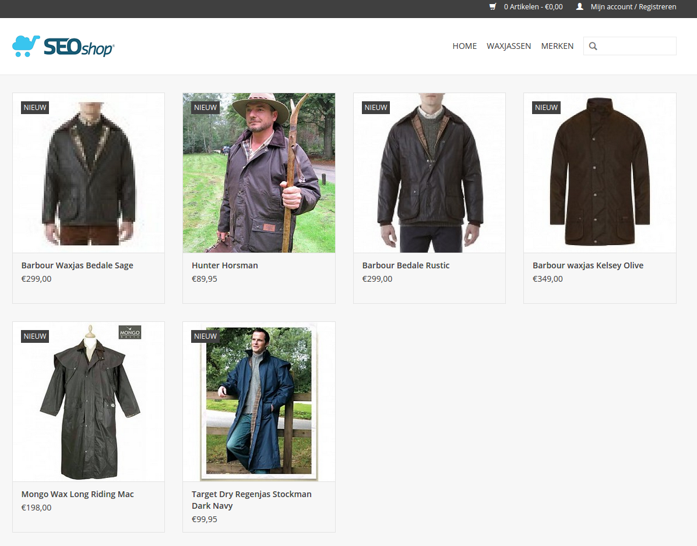
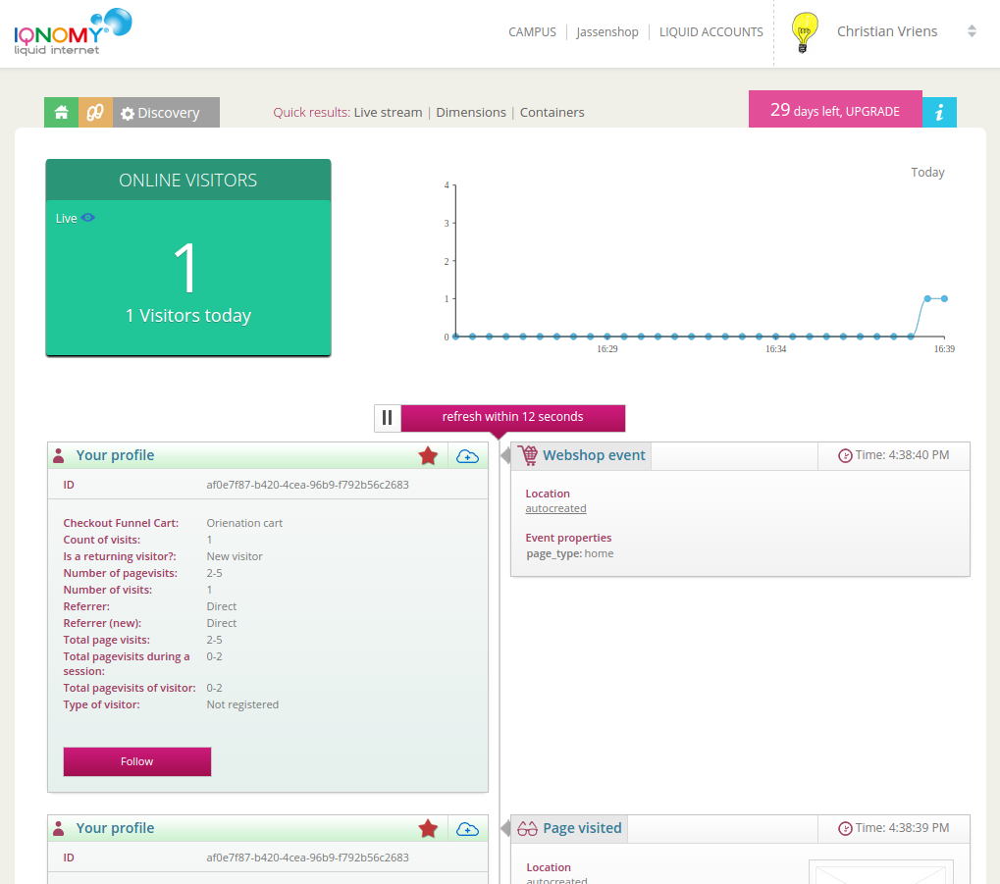

.. _seoshop:

#######
SEOshop
#######

.. contents::

Install plugin
==============
If you install the IQNOMY SEOshop extension you will need to create an IQNOMY account first. See :ref:`Getting started <start>`

Plugin functionality
====================
* Automaticly create dimensions based on **your** product attributes
* Start tracking visitors on your website
* Build visitor profiles automaticly

Dimensions
==========

Live stream
===========

.. figure:: _static/images/SEOlivestream.png

Data tracked
============
Almost every step of your webshop visitors is tracked.
