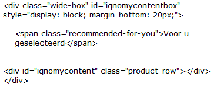

#######
Website
#######

************************
Tracking Code Quickstart
************************

The basic functionality of the script is tracking your website visitor.

The basic script should be on every website page

.. code-block:: javascript

   

.. note::
   On the XXXXXXX should be your unique Liquid Account id.

Using the script for Liquid Internet
====================================

.. seealso::
:ref:`Customize the script <websitescript>`

*******************
Personalize website
*******************

The websitescript can be used for personalization of your website. You can use the script for personalization with liquid internet without doing any other integration with your website code. By defining a container in IQNOMY you can inject HTML from a liquid content into your webpages.

Implement an empty div
======================
.. figure:: _static/images/adddiv1.png

'''Another option'''
If you are not sure about the div design you can contact your IT team or us.

