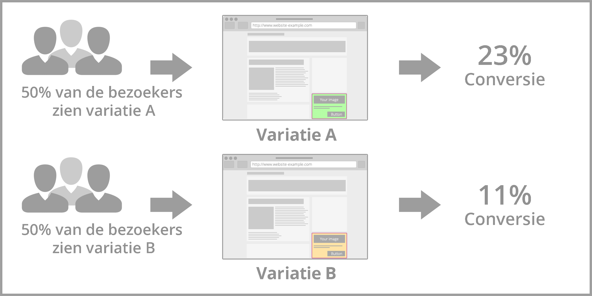

#############
Websitescript
#############

************************
Tracking Code Quickstart
************************

The basic script should be on every website page

.. code-block:: javascript

   

.. note::
   On the XXXXXXX should be your unique Liquid Account id.

Using the script for Liquid Internet
====================================

You can use the script for liquid internet without doing any other integration with your website code.

.. seealso::
:ref:`Customize the script <websitescript>`

*******************
Personalise website
*******************

Implement an empty div
======================
.. figure:: _static/images/adddiv1.png

'''Another option'''
If you are not sure about the div design you can contact your IT team or us.

.. figure:: _static/images/adddiv2.png

AB testing
==========
With A / B testing you research different website designs to get insights in which variant is converting the best. This version is for your website visitors the most attractive. Via A/B testing it is not necessary to get a new homepage immediately. By testing different versions, you choose the best converting version of your current website. A / B testing will be to contribute to a improve sales.

Advantages
----------

* Visitors do not know they participate in a test
* Reliable results that can be easily compared
* Improving the customer experience and relevance

To do's
-------

#. Design content variantions you would like to test among your website visitors
 First consider the target audience you want to reach with your A/B test. All the website visitors who are interested in a special product
 category or all the website visitors that would like to go on vacation in the Summer period.
Every type of content is possible, banners, text, HTML.

#. If you designed the content you need to create your Liquid Container. Go to Discovery, make sure you have a Liquid Internet account. In the Disovery screen, click on Containers. The first step is [[Who]] choose option: All people and A/B test. Just follow the steps. In the end you will reach the Summary page.

The next thing, is to link the different contents to the specific target group. If you did not create dimensions yet, click [[dimensions]]. To link and preview your composed Liquid Contents go to [[Discovery]], visit [[Liquid_content]] click on the eye icon. Here you can preview and adjust your Liquid Contents. If you click on adjust and scroll down you see all the dimensions. Choose for every Liquid Content the dimension option which is applicable.

 For example you would like to create your A/B test only for website visitors who are interested in the 'Summer vacation'. You have to make a
 dimension which indicates that it's about a Summer vacation. If you open a Liquid Content, you need to connect the Summer to this Liquid
 Content. Because it's an A/B test you have to make sure you have more than one Liquid Content.

Selection method
----------------

The name A/B test says enough about the selection method. IQNOMY works with a selection method of 100%. It is possible to share the 100% in different methods. You can choose to do 50% Personalization and 50% A/B test. It's dependent on the case. More information [[Liquid_Container_Selection_method]]

Settings
--------
Go to *Discovery*, visit Containers and go to the Summary page of a container.

.. figure:: _static/images/SelectionMethodLiquidContainter.png

Checklist Liquid Container activation
=====================================

* Selection method.

* LQIID
The landing page after clicking the link needs to have an lqiid parameter. In the liquid content you have to add $impressionUrlParam.

    example: http://www.iqnomy.com?$impressionUrlParam
    example: http://www.iqnomy.com?id=1234&$impressionUrlParam

* Liquid Contents connected to dimensions

