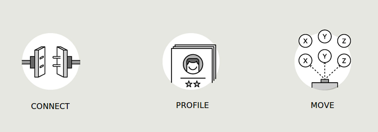

.. index:: Create account

.. include:: ../links.rst

.. _start:

###################
Five minute install
###################

.. contents::

*************************
Introduction Human Switch
*************************

The IQNOMY platform is a SaaS solution for organizations that want to be in control of their human connections. It has a foundation of 3 parts

Connect
   Connect the companies communication channels
Profile
   Build realtime richer customer profiles across those channels
Move
   Create realtime personal and relevant interaction

**First** you need to create an account!

**************
Create account
**************

Click the button and create your account

Steps in creating an account
============================

You are going to create a *Useraccount* and a *Liquid account*.

With a useraccount a user can have access to multiple Liquid Accounts. A Liquid
Account is used to collect data. Collected data and profiles from one liquid
account are seperated from another Liquid Account. Multiple users can have
access to 1 Liquid account. 

#. First create a user login.

   * Click the button above.
   * Fill in your emailadress and capcha.

#. You receive an email to confirm your emailadress.

   * Click on the link in the email.
   * Fill in your password.

#. Now you have a useraccount you can create a liquid account.

   * Fill in the name of your Liquid Account. Normally the organization name.
   * Click next and you will receive your website script also in your mailbox.

If you continue you will see and empty Live Stream because the script is not yet
on your website.

.. note::
   Untill you put the script on the website no data is being collected. 

*******
Connect
*******

When you create your liquid account you get the connection information for your
website. You can now connect your website!

To connect your website the script has to be on every webpage a visitor can
visit. There are several easy ways to do this. 

  * Put the script you received in your google tagmanager.
  * Integrate the script in your template between the body tags.
  * Send the email with script you received to a webdeveloper.

.. seealso::
   * :ref:`websitescript`
   * Other :doc:`Integrations <../integrations/index>`
   * Problems connecting? `Contact us`_

.. _are-you-connected:
   
Are you connected?
==================
You can check if you are connected by:

  #. Go to the website where you put the script
  #. Login_ your liquid account. You should see visitors in your Live Stream

Nothing visible in the Live Stream. Click on the button 'Discovery' in the top
left of your screen. The discovery page will open. The first item on this page
is *Channels*. Click on this icon. The page that will open shows you all the
channels that are connected.

If nothing is there `Contact us`_.

If your website is grayed out. Hover over your website and click the edit
button. Now you can activated your website. You can repeat this first two steps
in this connection check. 

Basic configuration
===================

You've already done part of the basic configuration by creating your account and
connecting your website. But now you want to get started building profiles and
using them. Go to :doc:`gettingstarted`.

.. _how-to-login:

###############
Start profiling
###############

First go to the :ref:`live-stream` to find some profiles. The stars represent the :ref:`engagescore` of this profile. The more stars a profile has the more data for this profile is collected. Click the follow button on a profile to see the profile details. Here you can see the data you collect at the moment.

:ref:`Dimensions <dimension>` enrich the profile and tell the marketeer something about this profile. For example: interest, returning, persona. Depending on the marketingcase you want to implement you will need certain data. Therefor you can create dimensions based on the data IQNOMY received in this profile.

In the basic configuration we start with creating a few interest dimensions.

.. seealso::
   * :ref:`profiling`: Theory and concepts about profiles.
   * :ref:`profile`: Developer documentation for the profile.
   * :ref:`magento`: A Magento integration will collect more data and pre-configure the profiles for you.

############
Start moving
############

Now you are building your first profiles. But if you want to use these profiles, you can start moving.

.. seealso::
   * :ref:`liquid-internet`
   * :ref:`emailmarketing`

#################
Other basic stuff
#################

*****
Login
*****

Follow your customers and Login_ regularly

You can also find this link on our website in the bottom right, 'login'.

************************
Open your liquid account
************************

Normally when you :ref:`how-to-login` to IQNOMY, you will automaticly open your Liquid Account.

But is is also possible that you are :ref:`invited <invited>` to multiple
liquid accounts or have created multiple liquid accounts. You can now choose the Liquid Account you want to open.

Opening a liquid account will open the `live-stream <Live Stream>` of this liquid account.

.. seealso::
  * :ref:`Invite user <invited>`
  * :ref:`Liquid Account overview <liquid-account-overview>` explained
  * :ref:`Add new Liquid Account <add-liquid-account>`
  * :ref:`Live Stream <live-stream>` explained

.. _invited:

************
Invite users
************

A user can have access to multiple liquid account and can invite other users to existing liquid accounts. If you get invited for your companies Liquid Account you can create your own user account.

:ref:`Login` and go to your username in the main navigation on top. Click :ref:`liquid-account` and then the tab :ref:`users`. You can invite a user by filling in his/her emailadress and press the button *invite user*. The user will now receive an invitation email and can create a useraccount to login.

Best is to give new users the role *reporter* so they can't change your configuration. You can always change this later.

###############
Need more help?
###############

`Contact us`_

