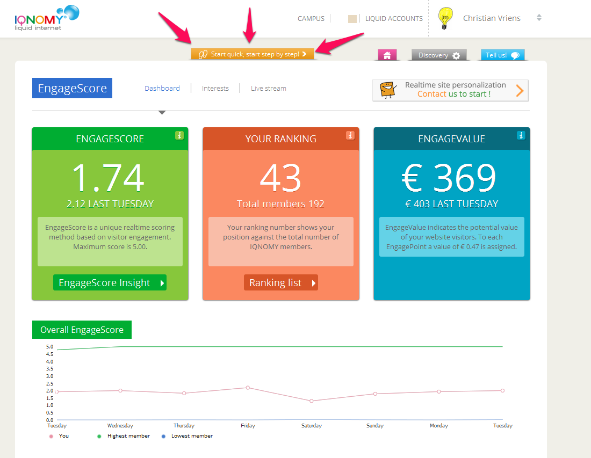
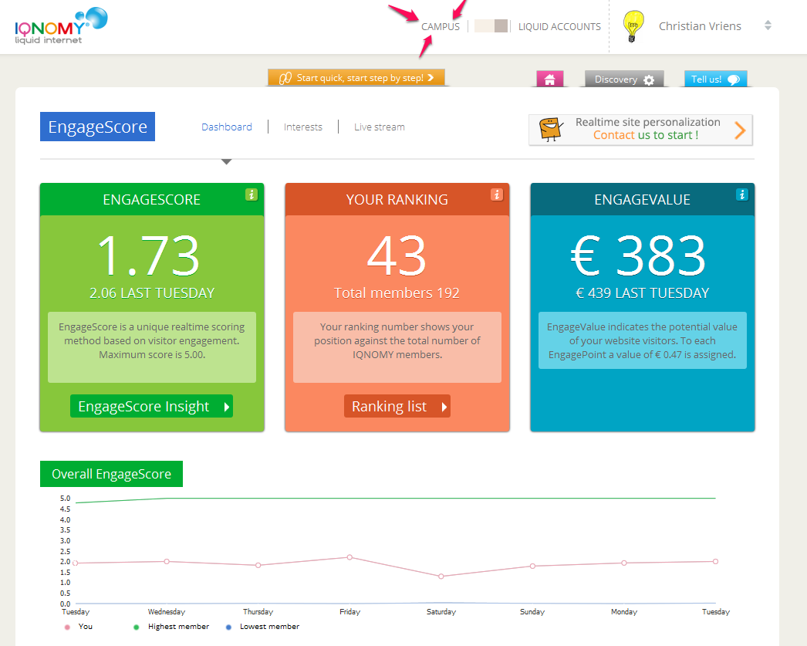

###############
Getting started
###############

Welcome
=======

Get invited
===========

A user can have access to multiple liquid account and can invite other users to existing liquid accounts. If you get invited for your companies Liquid Account you can create your own user account. 

Create a user account
=====================

Go to the IQNOMY homepage click on login and signup. You will receive an email with instructions to verify your account. After verifying your account you can create your own Liquid Account. 

Login
=====

If you want to login IQNOMY. Go to IQNOMY_ and click the login button. 
You can only login if you have a User account. With a User account you have access to your Liquid Account. Multiple users can have access to a Liquid Account. And 1 user can have access to different liquid accounts 

Step by step IQNOMY
===================

Login and click the button Start quick, start step by step to get help with the different options in IQNOMY.

Need more help
==============

Go to our Campus and find FAQ’s and documentation. In the screenshot you will see where to find our Campus.

.. _IQNOMY: http://www.iqnomy.com/
.. _slideshare: http://www.slideshare.net/iqnomy/iqnomy-how-to-part-1

